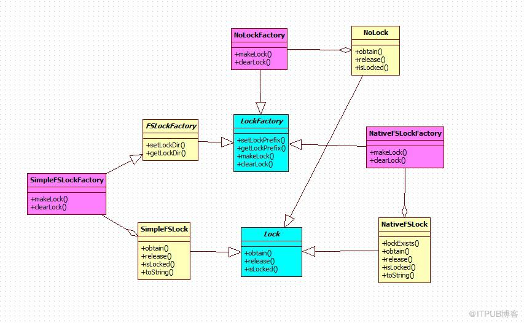
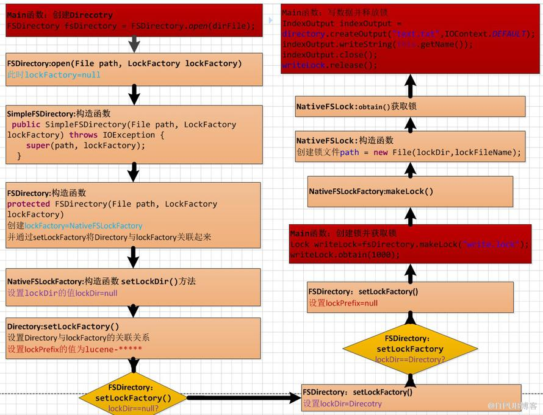

# Lucene存储的同步机制

参照：http://blog.itpub.net/28624388/viewspace-763629/

**同步机制原理**：Lucene的索引最终存储到磁盘的一个目录结构（Directory）中，在创建Directory的过程中会绑定一个LockFactory。LockFactory管理着其创建的所有Lock。LockFactory中有两个基本的属性lockDir(锁文件的存储目录)和lockPrefix（锁的前缀）。如果lockDir与Directory相同，则lockPrefix为空；如果不同，则会把Direcotry的路径经过一系列的算法转换返回一段字符串作为lockPrefix,如lucene-634de19d。LockFactory创建完成后，可通过Directory类中的makeLock(String name)方法，借助Directory关联的LockFactory来创建Lock.其中的参数name是创建锁文件的名称（如：“write.lock”），锁文件的存储位置由lockDir指定。Lock创建完成之后可通过Lock类中的obtain方法来加锁，release方法来解锁。  加锁时通过RandomAccessFile FileChannel 获取锁文件（如：“write.lock”）的读写控制 来代替对整个Directory目录下所有文件的读写控制。释放锁时会删除锁文件（如：“write.lock”）。




## 同步处理流程：

```java
public static void main(String[] args) {
try {
    File dirFile = new File("E:\\logs\\receive");
    FSDirectory fsDirectory = FSDirectory.open(dirFile);
    Lock writeLock=fsDirectory.makeLock("write.lock");
    writeLock.obtain(1000);
    IndexOutput indexOutput = directory.createOutput("text.txt",
            IOContext.DEFAULT);
    indexOutput.writeString(this.getName());
    indexOutput.close();
    writeLock.release();
}
```



> 多线程测试 code snippet:

```java
public class LockThreadTest extends Thread{
    private FSDirectory directory;
    private Lock writeLock;

    public LockThreadTest(FSDirectory directory,Lock writeLock)
    {
        this.directory=directory;
        this.writeLock=writeLock;
    }

    public void run(){
        try {
            if(writeLock.obtain())
            {
                System.out.println(this.getName()+"==已获取锁==");
                IndexOutput indexOutput = directory.createOutput("text.txt",
                        IOContext.DEFAULT);
                sleep(1000);
                indexOutput.writeString(this.getName());
                indexOutput.close();
                writeLock.release();
            }
            else {
                System.out.println(this.getName()+"==未获取锁==");
            }
        
        } catch (Exception e) {
            e.printStackTrace();
        }
    }
}

public class LockServerTest {
    public static void main(String[] args) throws Exception{
        File dirFile = new File("E:\\logs\\receive");
        FSDirectory fsDirectory = FSDirectory.open(dirFile);
        Lock writeLock = fsDirectory.makeLock("write.lock");

        for (int i = 0; i < 10; i++) {
            new LockThreadTest(fsDirectory, writeLock).start();
            Thread.sleep(1000);
        }
    }
}
```
