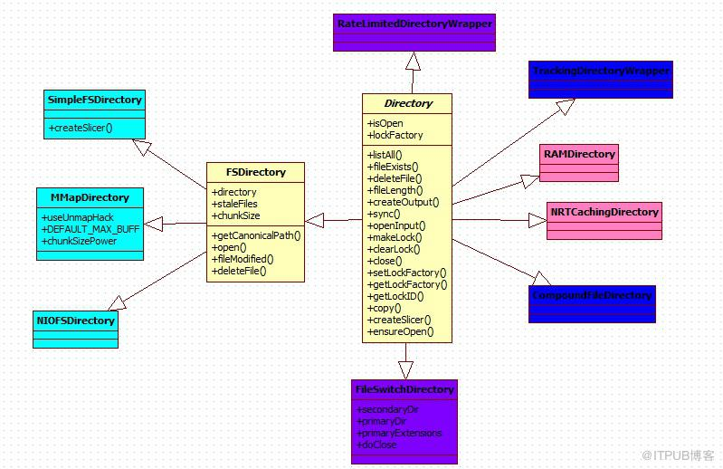
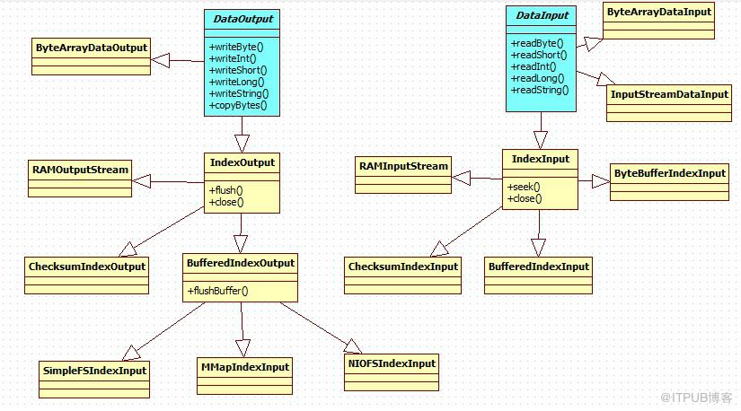

# Lucene存储的Directory类

LUCENE中的文件操作都是通过这Directory来实现的。Directory的实现类可以分为文件目录，内存目录和目录的代理类及工具类。

1. 文件目录

* SimpleFSDirectory:FSDirectory的简单实现,并发能力有限，遇到多线程读同一个文件时会遇到瓶颈，通常用NIOFSDirectory或MMapDirectory代替
* NIOFSDirectory：通过java.nio's FileChannel实行定位读取，支持多线程读（默认情况下是线程安全的）。该类仅使用FileChannel进行读操作，写操作则是通过FSIndexOutput实现。 注意：NIOFSDirectory 不适用于Windows系统，另外如果一个访问该类的线程，在IO阻塞时被interrupt或cancel，将会导致底层的文件描述符被关闭，后续的线程再次访问NIOFSDirectory时将会出现ClosedChannelException异常，此种情况应用SimpleFSDirectory代替。
* MMapDirectory：通过内存映射进行读，通过FSIndexOutput进行写的FSDirectory实现类。**使用该类时要保证用足够的虚拟地址空间(? 服务器通常会禁止使用虚拟内存, 这里是否会有冲突)**。另外当通过IndexInput的close方法进行关闭时并不会立即关闭底层的文件句柄，只有GC进行资源回收时才会关闭。

2. 内存目录

* RAMDirectory：常驻内存的Directory实现方式。默认通过SingleInstanceLockFactory（单实例锁工厂）进行锁的实现。该类不适合大量索引的情况。另外也不适用于多线程的情况。  在索引数据量大的情况下建议使用MMapDirectory代替。RAMDirectory是Directory抽象类在使用内存最为文件存储的实现类，其主要是将所有的索引文件保存到内存中。这样可以提高效率。但是如果索引文件过大的话，则会导致内存不足，因此，小型的系统推荐使用，如果大型的，索引文件达到G级别上，推荐使用FSDirectory
* NRTCachingDirectory：是对RAMDirectory的封装，适用于近乎时时（near-real-time）操作的环境。

3. Direcotry的代理类及工具类

* FileSwitchDirectory:文件切换的Directory实现.针对lucene的不同的索引文件使用不同的Directory .借助FileSwitchDirectory整合不同的Directory实现类的优点于一身比如MMapDirectory,借助内存映射文件方式提高性能，但又要减少内存切换的可能 ，当索引太大的时候，内存映射也需要不断地切换，这样优点也可能变缺点，而之前的NIOFSDirectory实现java NIO的方式提高高并发性能，但又因高并发也会导致IO过多的影响，所以这次可以借助FileSwitchDirectory发挥他们两的优点。
* RateLimitedDirectoryWrapper:通过IOContext来限制读写速率的Directory封装类。
* CompoundFileDirectory：用于访问一个组合的数据流。仅适用于读操作。对于同一段内扩展名不同但文件名相同的所有文件合并到一个统一的.cfs文件和一个对应的.cfe文件内。.cfs文件由Header，FileData和FileCount组成。.cfe文件由Header，FileCount,FileName,DataOffset,DataLength组成。.cfs文件中存储着索引的概要信息及组合文件的数目（FileCount）。.cfe文件存储文件目录的条目内容，内容中包括文件数据扇区的起始位置，文件的长度及文件的名称。
* TrackingDirectoryWrapper：Directory的代理类。用于记录哪些文件被写入和删除。

4. Direcotry读写对象的类图

