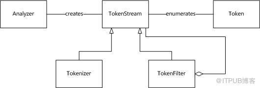
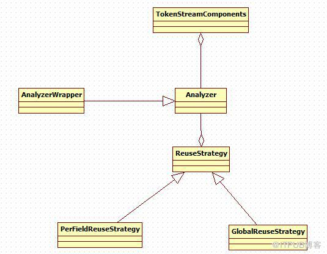
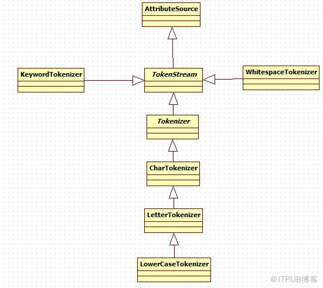

# Analyzer类

Analyzer，文本分析的过程，实质上是将输入文本转化为文本特征向量的过程。

Analyzer包含两个核心组件，Tokenizer以及TokenFilter。两者的区别在于，前者在字符级别处理流，而后者则在词语级别处理流。Tokenizer是Analyzer的第一步，其构造函数接收一个Reader作为参数，而TokenFilter则是一个类似拦截器的东东，其参数可以是TokenStream、Tokenizer，甚至是另一个TokenFilter。整个Lucene Analyzer的过程如下图所示：



## Analyzer

Analyzer类是一个抽象类，是所有分析器的基类。为了定义分析器的具体工作. 其子类必须通过自己的createComponents(String, Reader)方法来定义TokenStreamComponents。在调用方法tokenStream(String, Reader)的时候，TokenStreamComponents会被重复使用。

Analyzer包含两个核心组件，Tokenizer以及TokenFilter。两者的区别在于，前者在字符级别处理流，而后者则在词语级别处理流。Tokenizer是Analyzer的第一步，其构造函数接收一个Reader作为参数，而TokenFilter则是一个类似的拦截器，其参数可以是TokenStream、Tokenizer。



## TokenStreamComponents

该类封装了一个分词流的外部组件，简单封装输入Tokenizer和输出TokenStream

## ReuseStrategy

定义Analyzer每次调用tokenStream(String, java.io.Reader)时，TokenStreamComponents的重用策略。getReusableComponents(String fieldName)根据字段名获取可重用的TokenStreamComponents组建。

## Tokenizer



### Tokenizer各类介绍：

1. Tokenizer
输入为Reader的TokenStream，其子类必须实现incrementToken()函数，并且在设置属性(attributes) 必须调用AttributeSource中的clearAttributes()方法。

2. CharTokenizer
一个简单的，基于字符（character）的tokenizers。

```java
protected abstract boolean isTokenChar(int c);//判断是否应该加入token

protected int normalize(int c) {
    return c;
}//对每一个即将加入到token的字符进行处理，默认不进行任何操作，直接返回（其子类可能使用此方法，比如lowercase tokens）
```

3. LetterTokenizer
一个将文本在非字母的地方进行拆分的tokenizer，对于亚洲语系来说并不适合，因为其
大部分单词并不是以空格划分的。

```java
protected boolean isTokenChar(int c) {
    return Character.isLetter(c);//收集符合要求的字符
}
```

4. LowerCaseTokenizer
一个将文本在非字母的地方拆分并转换成小写的Tokenizer，其作用类似于LetterTokenizer与LowerCaseFilter的组合。

```java
protected int normalize(int c) {
    return Character.toLowerCase(c);//字母转换成小写
}
```

5. WhitespaceTokenizer
一个在空白处对文本进行拆分的tokenizer。

```java
protected boolean isTokenChar(int c) {
    return !Character.isWhitespace(c);//判断字符是否为空白
}
```

6. KeywordTokenizer
将整个输入作为一个分词的tokenizer。

## TokenFilter


### TokenFilter各类介绍：

1. TokenFilter
输入参数为另一个TokerStream的TokerStream，其子类必须覆盖incrementToken()函数。

2. LowerCaseFilter
将Token分词转换为小写。

3. FilteringTokenFilter

TokenFilters的一个抽象类，可能会删除分词。如果当前分词要保存，则需要实现accept()方法并返回一个boolean值。incrementToken（）方法将调用accept()方法来决定是否将当前的分词返回给调用者。

4. StopFilter
从token stream中移除停止词（stop words）.

```java
protected boolean accept() {
    return !stopWords.contains(termAtt.buffer(), 0, termAtt.length());//返回不是stop word的分词
}
```

5. TypeTokenFilter
从token stream中移除指定类型的分词。
  
```java
protected boolean accept() {
    return useWhiteList == stopTypes.contains(typeAttribute.type());
}
```

### StopAnalyzer测试实例：

```java
public class StopAnalyzerTest {
    public static void main(String[] args) {
        String content="No news is good news!";
        try {
            StopAnalyzer analyzer=new StopAnalyzer(Version.LUCENE_43);
            TokenStream tokenStream=analyzer.tokenStream("", new StringReader(content));
            tokenStream.reset();
            while (tokenStream.incrementToken()) {
                CharTermAttribute attribute=tokenStream.getAttribute(CharTermAttribute.class);
                System.out.println(attribute.toString());
            }
        } catch (Exception e) {
            e.printStackTrace();
        }
    }
}
```

```txt
输出结果：

news
good
news
```