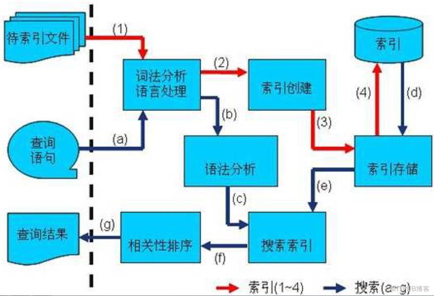

# lucene原理及索引和检索的过程

Lucene是一个高效的，基于Java的全文检索库。全文检索的基本思路，也即将非结构化数据中的一部分信息提取出来，重新组织，使其变得有一定结构，然后对此有一定结构的数据进行搜索，从而达到搜索相对较快的目的。这部分从非结构化数据中提取出的然后重新组织的信息，我们称之索引。**索引：已知文档中查找包含哪些字符串；反向索引：已知字符串查找在哪些文档中包含。**



## 索引过程

1. 有一系列被索引文件
2. 被索引文件经过语法分析和语言处理形成一系列词(Term)。
3. 经过索引创建形成词典和反向索引表。
4. 通过索引存储将索引写入硬盘。

```java
public class IndexTest {
    public static void main(String[] args) {
        try {
            File fileDir =new File("F:\\document");
            IndexWriterConfig config=new IndexWriterConfig(Version.LUCENE_43, new StandardAnalyzer(Version.LUCENE_43));
            config.setOpenMode(OpenMode.CREATE);
            IndexWriter writer=new IndexWriter(FSDirectory.open(new File("F:\\index")),config);
            for(File file:fileDir.listFiles())
            {
                Document document=new Document();
                document.add(new TextField("content", new FileReader(file)));
                document.add(new StringField("title", file.getName(), Store.YES));
                writer.addDocument(document);
            }
            writer.close();
        } catch (Exception e) {
            e.printStackTrace();
        }
    }
}
```

##  搜索过程

1. 用户输入查询语句。
2. 对查询语句经过语法分析和语言分析得到一系列词(Term)。
3. 通过语法分析得到一个查询树。
4. 通过索引存储将索引读入到内存。
5. 利用查询树搜索索引，从而得到每个词(Term)的文档链表，对文档链表进行交，差，并得到结果文档。
6. 将搜索到的结果文档对查询的相关性进行排序。
7. 返回查询结果给用户。

```java
public class SearchTest {
    public static void main(String[] args) {
        try {
            IndexReader reader=DirectoryReader.open(FSDirectory.open(new File("F:\\index")));
            IndexSearcher searcher=new IndexSearcher(reader);
            Analyzer analyzer=new StandardAnalyzer(Version.LUCENE_43);
            
            QueryParser queryParser=new QueryParser(Version.LUCENE_43, "content", analyzer);
            
            Query query=queryParser.parse("lucene");
            TopDocs topDocs=searcher.search(query, 10);
            
            ScoreDoc[] hits=topDocs.scoreDocs;
            
            for(int i=0;i      {
                System.out.println("score:"+hits[i].score);
                System.out.println("title:"+searcher.doc((hits[i].doc)).get("title"));
            }
        
        } catch (Exception e) {
            e.printStackTrace();
        }   
    }
}
```