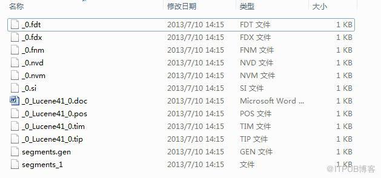
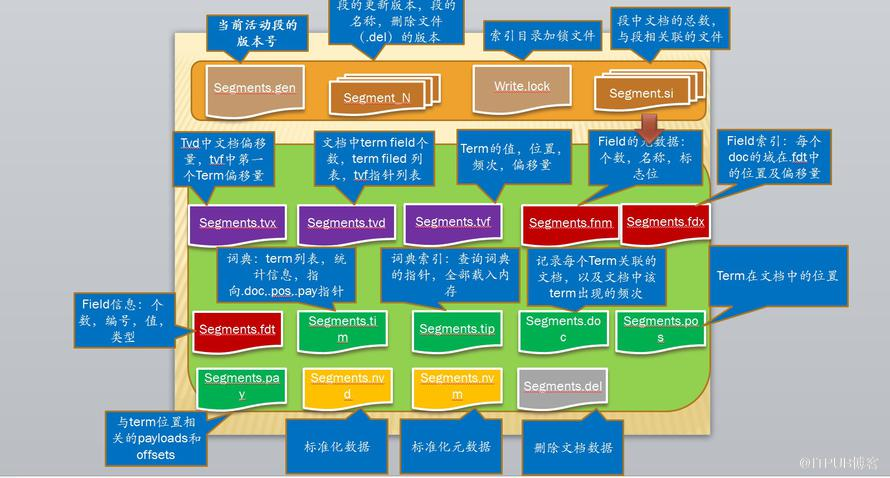

# 索引结构

**索引是一系列document的集合，document是一系列field的集合，filed是一系列term的集合，term是一系列bytes的集合，同一个bytes序列，在不同的field中被认为是不同的term;因此term由一对值组成：field name(string)和field value(bytes).一个索引由多个子索引即段(segments)组成，段是一个完全独立的索引，将会被单独搜索。**

Lucene通过一个整型的文档编码来关联文档（document）,第一个文档的编码为0，其他文档的编码依次递增。文档的编码可能会变更因此在lucene之外存储这些编码的时候要格外小心。

文档编码通常在以下情况下会发生变更：
1. 每个段中的文档编码是唯一的，但在一个大的上下文中文档编码必须进行转换。一个标准的做法是每个段建立的时候分配一个编码的范围。比如有两个段，每个段中有5个document;那么第一个段中编码起始值则为0，第二个则为5.
2. 当文档被删除时，文档的编码就会产生空缺。这些空缺最终会在索引的合并过程中消失。

## 索引结构概览

1. 段信息：有关段的元数据，比如文档的个数及文件的类型。
2. 域名称 ：索引中所包含域名称的集合。
3. 存储的域值：比如文档的标题，url等信息
4. 分词字典(Term dictionary): 包含所有文档中的索引域的字典，字典中也包含分词所在文档的个数，以及分词出现的频率
5. 分词频率数据（Term Frequency data）：包含某个分词的文档数，以及该分词在每个文档中出现的频率。
6. 分词指针数据：记录字典中每个分词在文档中的出现位置。
7. 规范化因子：存储文档中每个域的打分情况。
8. 分词向量：保存分词的文本信息和频率。
9. per-document values;
10. 已删除的文档：跟踪被删除的document信息。

## 索引文件命名：

具有相同文件名的文件属于同一个段。所有的段存储在同一个目录下。

1. segments file:  segments.gen,segments_N  存储提交点的相关信息
2. Lock File: write.lock  防止多个IndexWriter操作同一个文件
3. Compound File: .cfs,.cfe  一个可选的虚拟文件，由文件句柄经常被用尽的其他索引文件组成。
4. Fields .fnm  存储有关域的相关信息
5. Field Index .fdx 指向与数据的指针
6. Field Data .fdt  存储文档中的域数据
7. Term Dictionary .tim  保存分词相关信息
8. Term Index .tip  分词字典索引
9. Frequencies .doc 包含分词频率的文档列表
10. Positions .pos 分词在索引中的位置信息
11. Payloads .pay 字符偏移量和权重信息
12. Norms .nvd, .nvm Encodes length and boost factors for docs and fields
13. Per-Document Values .dvd, .dvm Encodes additional scoring factors or other per-document information.
14. Term Vector Index .tvx Stores offset into the document data file
15. Term Vector Documents .tvd Contains information about each document that has term vectors
16. Term Vector Fields .tvf The field level info about term vectors
17. Deleted Documents .del Info about what files are deleted

