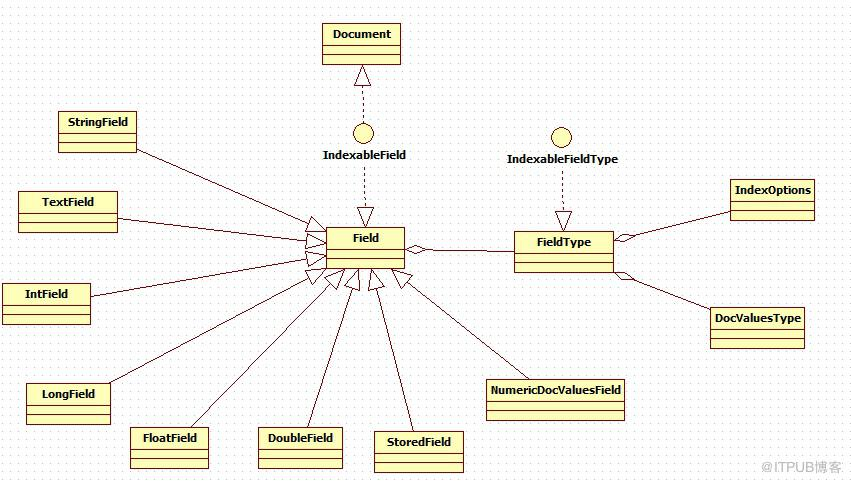

# Field类

Field类：文档中的一个域，在事实上控制着被索引的域值。其组成部分包括type(域的类型)，name(域的名称)，fieldsData(域的值)，boost(加强因子).

## 域的类型FieldType：描述Field的相关属性

1. private boolean indexed; 对field是否进行索引操作.
2. private boolean tokenized;是否使用分析器将域值分解成独立的语汇单元流。该属性仅当indexed()为ture时有效.
3. private boolean stored;是否存储field的值。如果true,原始的字符串值全部被保存在索引中，并可以由IndexReader类恢复。该选项对于需要展示搜索结果的一些域很有用（如URL，标题等）。如果为false,则索引中不存储field的值，通常用来索引大的文本域值。如Web页面的正文。
4. private boolean storeTermVectors;当lucene建立起倒排索引后，默认情况下它会保存所有必要的信息实施Vector Space Model。该Model需要计算文档中出现的term数，以及他们出现的位置。该属性仅当indexed为true时生效。他会为field建立一个小型的倒排索引。
5. private boolean storeTermVectorOffsets;表示是否存储field的token character的偏移量到 term vectors向量中。
6. private boolean storeTermVectorPositions;表示是否存储field中token的位置到term vectors 向量中。
7. private boolean storeTermVectorPayloads;是否存储field中token的比重到term vectors中。
8. private boolean omitNorms;是否要忽略field的加权基准值，如果为true可以节省内存消耗，但在打分质量方面会有更高的消耗，另外你也不能使用index-time  进行加权操作。
9. private IndexOptions indexOptions;描述什么可以被记录到倒排索引当中。
DOCS_ONLY：仅documents被索引，term的频率和位置都将被忽略。针对field的短语或有关位置的查询都将抛出异常。
DOCS_AND_FREQS：documents和term的频率被索引，term的位置被忽略。这样可以正常打分，但针对field的短语或有关位置的查询都将抛出异常。
DOCS_AND_FREQS_AND_POSITIONS：这是一个全文检索的默认设置，打分和位置检索都支持。
DOCS_AND_FREQS_AND_POSITIONS_AND_OFFSETS：索引字符相对位置的偏移量。
10. private DocValuesType docValueType;DocValues  的类型，如果非空，field的值将被索引成docValues.
NUMERIC:数字类型
BINARY：二进制类型
SORTED：只保存不同的二进制值 byte[]
SORTED_SET.
11. private boolean frozen; 阻止field属性未来可能的变更，该属性通常在FieldType   属性已经被设置后调用。是为了防止无意识的变更。

## Field类的构造函数

1. protected Field(String name, FieldType type)创建一个无初始值的field.
2.  public Field(String name, Reader reader, FieldType type)
使用Reader而不是String对象来表示域值。在这种情况下，域值是不能被存储的，并且该域会一直用于分析和索引。请参照TextField
3. public Field(String name, TokenStream tokenStream, FieldType type)使用TokenStream而不是String对象来表示域值。在这种情况下，域值是不能被存储的，并且该域会一直用于分析和索引。请参照TextField
4. public Field(String name, byte[] value, FieldType type)用二进制来表示域值，不能被索引。

## Field子类介绍（部分）

1. StringField：整个string作为一个单独的分词token.
2. TextField:A field that is indexed and tokenized, without term
  vectors.  For example this would be used on a 'body'  field, that contains the bulk of a document's text.
3. IntField:索引int值得域，用来进行范围过滤和排序（使用NumericRangeQuery，NumericRangeFilter，SortField.Type#INT）
4. StoredField：域值存储到索引，以便查询的时候进行展示。
5. NumericDocValuesField：每个文档存储一个long值，用于排序或值检索。