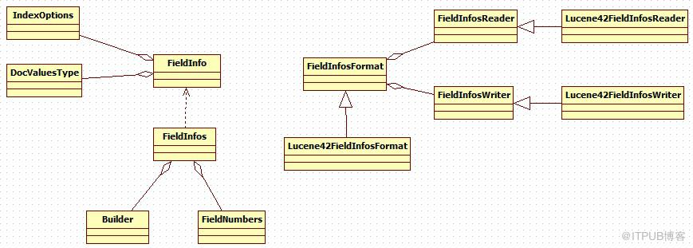
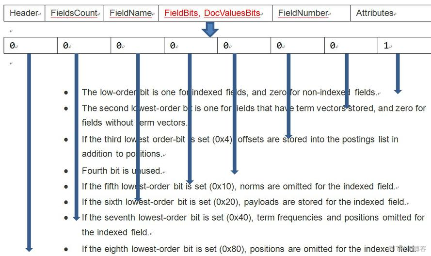

# FieldInfo相关类

在索引的文件结构中.fnm文件中存储着field的相关信息：Header, FieldName, FieldBits, DocValuesBits, FieldNumber 和 Attributes 具体通过`Lucene42FieldInfosFormat`类实现



## Lucene42FieldInfosFormat 定义field信息文件的保存格式与内容

Lucene42FieldInfosFormat 通过 Lucene42FieldInfosReader和Lucene42FieldInfosWriter两个类来控制着对field 信息文件（.fnm）的读写。



Lucene42FieldInfosWriter 类中的write方法完成文件的写入操作

```java
public void write(Directory directory, String segmentName, FieldInfos infos, IOContext context) throws IOException {
    final String fileName = IndexFileNames.segmentFileName(segmentName, "", Lucene42FieldInfosFormat.EXTENSION);
    IndexOutput utput = directory.createOutput(fileName, context);
    boolean success = false;
    try {
      CodecUtil.writeHeader(output, Lucene42FieldInfosFormat.CODEC_NAME, Lucene42FieldInfosFormat.FORMAT_CURRENT);
      output.writeVInt(infos.size());
      for (FieldInfo fi : infos) {
        IndexOptions indexOptions = fi.getIndexOptions();
        byte bits = 0x0;
        if (fi.hasVectors()) bits |= Lucene42FieldInfosFormat.STORE_TERMVECTOR;
        if (fi.omitsNorms()) bits |= Lucene42FieldInfosFormat.OMIT_NORMS;
        if (fi.hasPayloads()) bits |= Lucene42FieldInfosFormat.STORE_PAYLOADS;
        if (fi.isIndexed()) {
          bits |= Lucene42FieldInfosFormat.IS_INDEXED;
          assert indexOptions.compareTo(IndexOptions.DOCS_AND_FREQS_AND_POSITIONS) >= 0 || !fi.hasPayloads();
          if (indexOptions == IndexOptions.DOCS_ONLY) {
            bits |= Lucene42FieldInfosFormat.OMIT_TERM_FREQ_AND_POSITIONS;
          } else if (indexOptions == IndexOptions.DOCS_AND_FREQS_AND_POSITIONS_AND_OFFSETS) {
            bits |= Lucene42FieldInfosFormat.STORE_OFFSETS_IN_POSTINGS;
          } else if (indexOptions == IndexOptions.DOCS_AND_FREQS) {
            bits |= Lucene42FieldInfosFormat.OMIT_POSITIONS;
          }
        }
        output.writeString(fi.name);
        output.writeVInt(fi.number);
        output.writeByte(bits);

        // pack the DV types in one byte
        final byte dv = docValuesByte(fi.getDocValuesType());
        final byte nrm = docValuesByte(fi.getNormType());
        assert (dv & (~0xF)) == 0 && (nrm & (~0x0F)) == 0;
        byte val = (byte) (0xff & ((nrm << 4) | dv));
        output.writeByte(val);
        output.writeStringStringMap(fi.attributes());
      }
      success = true;
    } finally {
    if (success) {
            output.close();
        } else {
            IOUtils.closeWhileHandlingException(output);
        }
    }
}
```

## FieldInfo类

该类用于访问field信息文件。每个段都有一个独立的field信息文件（.fnm文件，该文件中存储着field的描述信息和该域是否被索引）。该类的实例是线程安全的，再没有其他读写线程的情况下，只允许一个线程添加field到文档中。

```java
public final String name;//field的名称
public final int number;// field的内部编号，这个值表示 fieldinfos中FieldInfo的编号。

//返回该域的索引选项，如果indexed=false 则返回null
public IndexOptions getIndexOptions() {
    return indexOptions;
}

//判断该域是否有docValues, DocValues 存储在每个文档中，每个文档的域可包含一个给定类型的值。DocValues类型可以为每个文档提供存储额外的类型数据。类似：PayLoad, 可以在用这个特性自定义排序打分参数
public boolean hasDocValues() {
    return docValueType != null;
}

//返回加权基准的类型，如果该域存在加权基准。在索引期间，文档中相同域的所有加权都被合并成一个单一的浮点数。除了域，文档也有自己的加权值。Lucene会基于域的
public DocValuesType getNormType() {
    return normType;
}
```

## FieldInfos FieldInfo的集合类。其内置了一个FieldNumbers类和一个Builder类。

FieldNumbers用来为field进行统一的编号（Field Number）

Builder用来添加新的FieldInfo