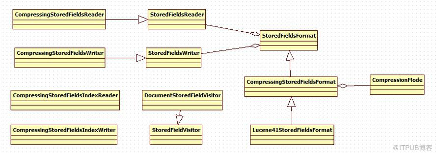
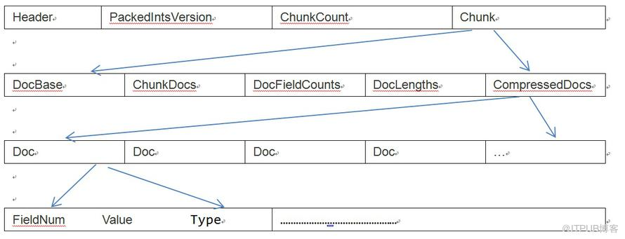

# Field data和Field index

## Lucene41StoredFieldsFormat

域存储文件格式。会生成两个文件，一个是`.fdt`文件是域的数据文件，另外一个是`.fdx`文件是域的索引文件。

> 数据文件结构：

## CompressingStoredFieldsIndexWriter

该类能够生成一个文件（.fdx）,该文件采用高效的内存数据结构，能够被加载到内存当中。能够开始定位包含document的块。为了有一个紧凑的内存表示，每个block由1024个chunk组成。Index计算平均每个chunk的字节数。对于每个chunk来说仅存储其距开始位置的偏移量及chunk的大小。

由域数据文件格式我们知道，每篇文档包含的域的个数，每个存储域的值都是不一样的，因而域数据文件中segment size 篇文档，每篇文档占用的大小也是不一样的，那么如何在fdt 中辨别每一篇文档的起始地址和终止地址呢，如何能够更快的找到第n 篇文档的存储域的信息呢？就是要借助域索引文件。

域索引文件也总共有segment size 个项，每篇文档都有一个项，每一项都是一个long，大小固定，每一项都是对应的文档在fdt 文件中的起始地址的偏移量，这样如果我们想找到第n 篇文档的存储域的信息，只要在fdx 中找到第n 项，然后按照取出的long 作为偏移量，就可以在fdt 文件中找到对应的存储域的信息

## CompressionMode

压缩模型。定义应该花费多少的工作在解压缩上面。有FAST，HIGH_COMPRESSION，FAST_DECOMPRESSION几种模型。

## StoredFieldVisitor

提供一个低级别的方式访问index中的域值。其实现类在同一个reader中不要尝试去加载或访问另外一个存储文档。

## DocumentStoredFieldVisitor

StoredFieldVisitor的实现类，用于加载文档中的所有存贮域或者加载指定名称的域。通常被IndexReader的document(int)方法用来加载一个document.

## StoredFieldsWriter

用于存储field.对于每个document来说，首先调用startDocument(int)来确定将有多少field写入文档，然后调用wirteField(FieldInfo,IndexableField)往document中写field. 写完之后调用finish(FieldInfos,int)方法来进行验证和检查。最后调用close()方法来关闭writer.