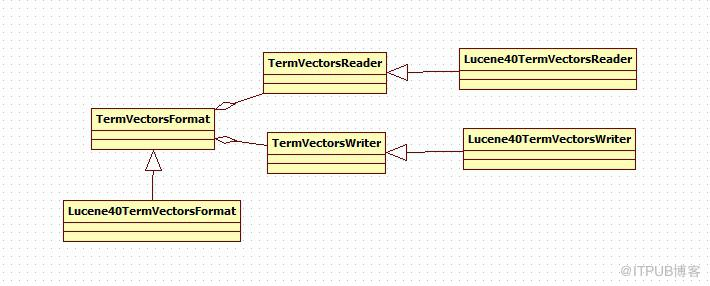

# Term Vector词向量文件

词向量(Term Vector)对一个域来说是一个可选择的基础组成项。词向量信息是从索引(index)到文档(document)到域(field)到词(term)的正向信息，有了词向量信息，我们就可以得到一篇文档包含那些词的信息。它有三个文件组成。

## 词向量索引文件.tvx

1. 一个段(segment)包含N 篇文档，此文件就有N 项，每一项代表一篇文档。
2. 每一项包含两部分信息：第一部分是词向量文档文件(tvd)中此文档的偏移量DocumentPosition，第二部分是词向量域文件(tvf)中此文档的第一个域的偏移量FieldPosition。

## 词向量文档文件.tvd

一个段(segment)包含N 篇文档，此文件就有N 项，每一项包含了此文档的具有Term向量的域的信息。包括文档中field的个数，具有Term向量的域的列表和指向.tvf文件中域信息的指针列表。

.tvd文件用来映射出含有term向量的field,以及这些域的信息在.tvf文件中的位置。

1. 每一项首先是此文档包含的域的个数NumFields
2. 然后是一个NumFields 大小的数组FiledNums，数组的每一项是域号。
3. 然后是一个(NumFields - 1)大小的数组FieldPositions，由前面我们知道，每篇文档的第一个域在tvf 中的偏移量在tvx 文件中保存，而其他(NumFields - 1)个域在tvf 中的偏移量就是第一个域的偏移量加上这(NumFields - 1)个数组的每一项的值。

## 词向量域文件.tvf

1. 此文件包含了此段中的所有的域，并不对文档做区分，到底第几个域到第几个域是属于那篇文档，是由tvx 中的第一个域的偏移量以及tvd 中的(NumFields - 1)个域的偏移量来决定的
2. 对于每一个域，首先是此域包含的词的个数NumTerms，然后是一个8 位的byte，最后一位是指定是否保存位置信息，倒数第二位是指定是否保存偏移量信息。然后是NumTerms 个项的数组，每一项代表一个词(Term)，对于每一个词，由词的文本TermText，词频TermFreq(也即此词在此文档中出现的次数)，词的位置信息，词的偏移量信息

## Term Vector相关类

## TermVectorsWriter

用于term向量的写操作的codec API

1. 对于每个文档来说首先调用startDocument(int numVectorFields) 通知codec 有多少term field将会被写入。
2. 对于文档中的每个term field调用startField(FieldInfo info, int numTerms, boolean positions, boolean offsets, boolean payloads)方法，通知codec有多少个term将被写入(for that field)
3. 对于每个term 调用startTerm(BytesRef term, int freq) 方法  添加term和term的频次
4. 如果offsets和posiions有效，将调用addPosition(int position, int startOffset, int endOffset, BytesRef payload) 方法 添加term的
位置和偏移量
5. 当term及其位置信息写完后调用finishTerm() 方法
6. 当field的所有term都写完后，调用finishField()方法。
7. 当一个document的所有域都写完后，调用finishDocument()方法。
8. 当所有的文档都写完后，调用finish(FieldInfos fis, int numDocs) 方法进行验证和检查
9. 调用close()方法 关闭writer.