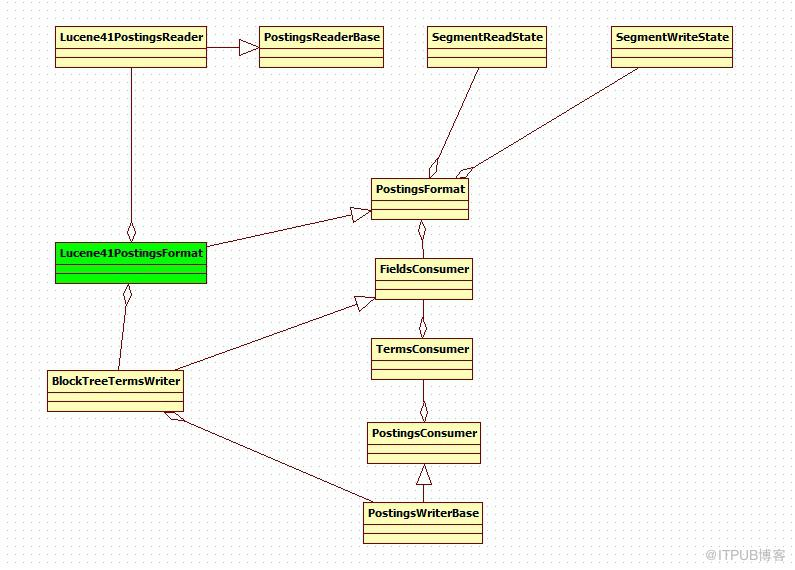

# Term Dictionary和Term Index

反向信息是索引文件的核心，也即反向索引。反向索引包括两部分，左面是词典(Term Dictionary)，右面是倒排表(Posting List)

## Lucene41PostingsFormat

倒排表格式，通过packed integer blocks来编码倒排表 

注意：这种格式处于测试阶段，如果有变更将不提供向后兼容。

1. Packed Blocks and VInt Blocks

在Packed Blocks 中，整数以相同的位数存贮，每个packed blocks固定能存储128个整数。VInt Blocks：块的大小可以变更。

2. Block structure:

    以一个Term存在于259个documen中的情况为例，前256个document的ID会被存在两个Packed Blocks中，剩下的三个会被存在一个VInt Blocks中。不同种类的数据通常会存在不同的Packed Blocks中。这种策略通常应用与成对出现的数据： , , , and .

3. Skipdata settings:
4. Positions, Payloads, and Offsets:
    Positions:文档中，当前term出现的位置
    payload:与当前位置相关联的blob元数据
    offset:一个数据对，记录当前位置上的分词起始偏移量和结束偏移量。

当payloads和offsets都不被忽略时，numPositions==numPayloads==numOffsets 。通常情况下，当通过packed block 编码时payloads和offsets被存储在一起，在.pay文件中；position的数据被另外存储到.pos文件中。

如果使用VInt blocks编码时，payloads,offsets和positons都被存储到文件.pos中。通过这种策略，大多数的payload和offset数据被存储在.pos文件中。 这对于一个只需要position信息，不需要payload和offset的查询来说，可以减少从磁盘中获取内容。

**Term Dictionary：**
词典文件即.tim文件中，包含着每个field的term列表，以及每个term的统计信息（如doc freq）还有指向.doc,.pos .pay等文件中有关frequencies,positions,payload和skip data等信息的指针。

**Term Index ：**
词典索引文件即.tip文件 是词典的一个索引，以便词典可以被随机访问。词典索引文件是为了加快对词典文件中词的查找速度，保存每隔IndexInterval 个
词。词典索引文件是会被全部加载到内存中去的。

**Frequencies and Skip Data：**
.doc文件中存储着包含每个term的document列表，以及term在每篇文档中出现的频次。此文件包含TermCount 个项，每一个词都有一项，因为每一个词都有自己的倒排表。对于每一个词的倒排表都包括两部分，一部分是倒排表本身，也即一个数组的文档号及词频，另一部分是跳跃表，为了更快的访问和定位倒排表中文档号及词频的位置。 对于文档号和词频的存储应用的是差值规则和或然跟随规则。

**Positions ：**
.pos文件中存储着每个Term在文档内的位置，有时为了加速访问，也会存储有关payloads和offsets数据。

**Payloads and Offsets：**
.pay文件存储document中的Term 位置相关的payloads和offsets数据。

## SegmentWriteState

segment写操作期间的一些共用参数

1. public final InfoStream infoStream; 调试信息控制
2. public final Directory directory; 段的存储位置
3. public final SegmentInfo segmentInfo;段的描述信息
4. public final FieldInfos fieldInfos;段中所以域的描述信息
5. public int delCountOnFlush;当要刷新段时，删除的文档个数
6. public final BufferedDeletes segDeletes;docIDUpto所有的含有改Term的文档都删除
7. public MutableBits liveDocs; 记录当前的文档，仅在有一个以上的已删除的文档才被使用。
8. public final String segmentSuffix; 段前缀
9. public int termIndexInterval; 设置Term词典中，多少Term应该被加载到内存中，越小使用的内存越多。
10. public final IOContext context; IO操作上下文。

## PostingsFormat

编解码terms, postings, and proximity data.

1. public abstract FieldsConsumer fieldsConsumer(SegmentWriteState state) throws IOException;//写一个新的段，返回FieldsConsumer

## FieldsConsumer

用以访问terms, doc, freq, prox, offset 和payloads 的反转列表。

1. 通过PostingsFormat的fieldsConsumer(SegmentWriteState)方法创建一个FieldsConsumer实例
2. 对于每个field，通过调用方法 
    public abstract TermsConsumer addField(FieldInfo field) throws IOException;//添加一个field来返回该field 的一个TermsConsumer
3. 所有field添加完以后，调用close()方法，关闭FieldsConsumer。

## TermsConsumer

用户访问一个独立field的所有Term。

1.通过FieldsConsumer的addField方法，为每一个field返回一个TermsConsumer实例
2.调用方法
    public abstract PostingsConsumer startTerm(BytesRef text) throws IOException;//开启一个新的term,如果文档中没有该Term，则结束。为每个Term 返回一个PostingsConsumer
3.当当前Term添加结束后，调用finishTerm方法
4.当当前field的所有分词都添加完成以后，调用finish方法。

## PostingsConsumer

用于访问Term对应的倒排表。

1. 通过调用TermsConsumer的startTerm方法，为每个term返回一个PostingsConsumer
2. 调用方法
    public abstract void startDoc(int docID, int freq) throws IOException;为该Term关联对应的document及该Term在该document出现的次数。
4. 如果field的positions开启，则该Term在当前document每次出现时，调用addPosition方法添加相关的position  payload,  start/end offset
5. 当所有文档的positions & payloads添加完以后，调用finishDoc()方法。

## PostingsWriterBase

PostingsConsumer的扩展类，支持一个可插拔的词典。

1.public abstract void start(IndexOutput termsOut) throws IOException;
//在Terms添加之前调用，用以些Header信息
2. public abstract void startTerm() throws IOException;
//开启一个新的Term,如果至少有一个document中含有该term,则对应的要调用finishTerm结束。

## BlockTreeTermsWriter

基于Block的terms index 和dictionary writer.

写.tim文件和.tip文件。