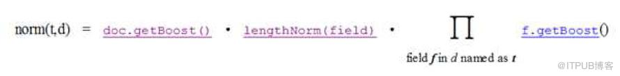
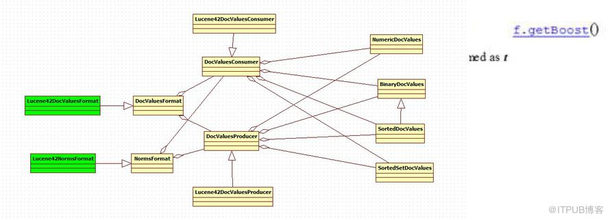

# 标准化因子文件(.nrm)

我们知道，在搜索过程中，搜索出的文档要按与查询语句的相关性排序，相关性大的打分(score)高，从而排在前面。相关性打分(score)使用向量空间模型(Vector Space Model)，在计算相关性之前，要计算Term Weight，也即某Term 相对于某Document 的重要性.

标准化因子(Normalization Factor)是会影响随后打分(score)的计算的，Lucene 的打分计算一部分发生在索引过程中，一般是与查询语句无关的参数如标准化因子，大部分发生在搜索过程中，会在搜索过程的代码分析中详述。标准化因子(Normalization Factor)在索引过程总的计算如下：

它包括三个参数：
* Document boost：此值越大，说明此文档越重要。
* Field boost：此域越大，说明此域越重要。
* lengthNorm(field) = (1.0 / Math.sqrt(numTerms))：一个域中包含的Term 总数越多，也即文档越长，此值越小，文档越短，此值越大。

从上面的公式，我们知道，一个词(Term)出现在不同的文档或不同的域中，标准化因子不同。比如有两个文档，每个文档有两个域，如果不考虑文档长度，就有四种排列组合，在重要文档的重要域中，在重要文档的非重要域中，在非重要文档的重要域中，在非重要文档的非重要域中，四种组合，每种有不同的标准化因子。

## NormsFormat

读写每个文档用打分的标准化因子的值

1. public abstract DocValuesConsumer normsConsumer(SegmentWriteState state) throws IOException
//返回一个DocValuesConsumer 用于些标准化值到index
2. public abstract DocValuesProducer normsProducer(SegmentReadState state) throws IOException;
//返回一个DocValuesProducer 从index读取标准化值

## DocValuesFormat

编解码每个文档的值

1. public abstract DocValuesConsumer fieldsConsumer(SegmentWriteState state) throws IOException;
//返回一个DocValuesConsumer 写docvalues到索引中
2. public abstract DocValuesProducer fieldsProducer(SegmentReadState state) throws IOException;
//返回一个DocValuesProducer 从索引中读取docvalues

## Lucene42DocValuesFormat

为每个文档编码四种类型（Numeric,Binary,Sorted,SortedSet）的数据，采用以下七种基本的策略

1. 增量压缩数字(Delta-compressed Numerics)：每个文档的整型数被写入4096个块中，每个块之保存最小的值，其他条目通过在最小值上的增量来表示。在Lucene 的反向索引中，需要保存很多整型数字的信息，比如文档ID 号，比如词(Term)在
文档中的位置等等。
由上面介绍，我们知道，整型数字是以VInt 的格式存储的。随着数值的增大，每个数字占用的Byte 的个数也逐渐的增多。所谓差值规则(Delta)就是先后保存两个整数的时候，后面的整数仅仅保存和前面整数的差即可
2. 表压缩数字(Table-compressed Numerics)：当唯一值得数量非常少的话，通过一个查询表来存这些数据，每个文档条目通过一个编号来访表中的数据。
3. 非压缩数字(Uncompressed Numerics):
4. 固定长度的二进制(Fixed-width Binary):
5. Variable-width Binary
6. Sorted
7. SortedSet

.dvd文件用于保存DocValues data，

.dvm文件用于保存DocValues metadata 元数据。如docvalues在.dvd文件中的偏移量。

## DocValuesProducer

用于生成numeric, binary 和sorted docvalues.

NumericDocValues getNumeric(FieldInfo field)
//public abstract long get(int docID);  返回数字类型的document id

BinaryDocValues getBinary(FieldInfo field)
//public abstract void get(int docID, BytesRef result); 返回文档的value

SortedDocValues getSorted(FieldInfo field)//每个document的值在一个SortedDocValues当中是删除重复的，解除引用的存在一个字典中的唯一值。一个指针指向字典用来获取每个文档。
// public abstract int getOrd(int docID); 返回文档在SortedDocValues 的序号

SortedSetDocValues getSortedSet(FieldInfo field)