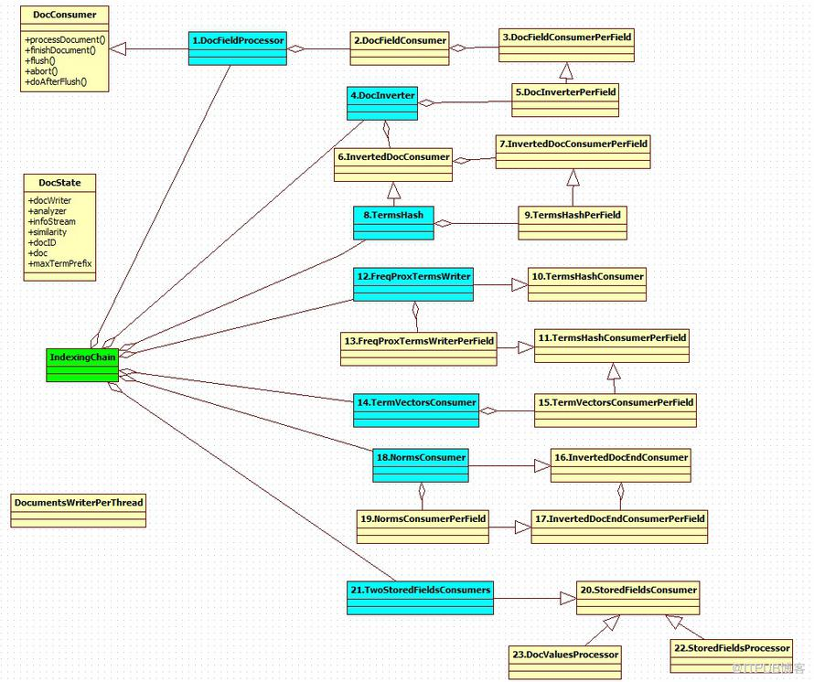

# index-chain

文档的索引过程是通过DocumentsWriter的内部数据处理链完成的

> IndexWriterConfig conf = new IndexWriterConfig(analyzer);

IndexWriterConfig的构造函数会调用父类的构造函数. 创建IndexWriterConfig会同时创建一个`indexerThreadPool`和`indexingChain`

```java
public IndexWriterConfig(Analyzer analyzer) {
    super(analyzer);
}

LiveIndexWriterConfig(Analyzer analyzer) {
    this.analyzer = analyzer;
    ramBufferSizeMB = IndexWriterConfig.DEFAULT_RAM_BUFFER_SIZE_MB;
    maxBufferedDocs = IndexWriterConfig.DEFAULT_MAX_BUFFERED_DOCS;
    mergedSegmentWarmer = null;
    delPolicy = new KeepOnlyLastCommitDeletionPolicy();
    commit = null;
    useCompoundFile = IndexWriterConfig.DEFAULT_USE_COMPOUND_FILE_SYSTEM;
    openMode = OpenMode.CREATE_OR_APPEND;
    similarity = IndexSearcher.getDefaultSimilarity();
    mergeScheduler = new ConcurrentMergeScheduler();
    indexingChain = DocumentsWriterPerThread.defaultIndexingChain; // 重点关注
    codec = Codec.getDefault();
    if (codec == null) {
      throw new NullPointerException();
    }
    infoStream = InfoStream.getDefault();
    mergePolicy = new TieredMergePolicy();
    flushPolicy = new FlushByRamOrCountsPolicy();
    readerPooling = IndexWriterConfig.DEFAULT_READER_POOLING;
    indexerThreadPool = new DocumentsWriterPerThreadPool(); // 重点关注
    perThreadHardLimitMB = IndexWriterConfig.DEFAULT_RAM_PER_THREAD_HARD_LIMIT_MB;
}
```

indexerThreadPool 实例有一个字段`private final List<ThreadState> threadStates = new ArrayList<>()`
至此，我们发现会创建一个ThreadState集合，通过对ThreadState的分析我们知道，ThreadState和一个DocumentsWriterPerThread关联，而DocumentsWriterPerThread中则包含着索引链的关键部分

接下来我们来分析ThreadState集合中的每个对象，是怎么跟DocumentsWriterPerThread关联起来的:

> indexWriter = new IndexWriter(directory, conf);

在创建`indexWriter`时会创建`docWriter`

```java
// 在IndexWriter的构造函数(该构造函数很长)中
docWriter = new DocumentsWriter(flushNotifications, segmentInfos.getIndexCreatedVersionMajor(), pendingNumDocs,
          enableTestPoints, this::newSegmentName,
          config, directoryOrig, directory, globalFieldNumberMap);
```

来到`DocumentsWriter`的构造函数

```java
DocumentsWriter(FlushNotifications flushNotifications, int indexCreatedVersionMajor, AtomicLong pendingNumDocs, boolean enableTestPoints,
                  Supplier<String> segmentNameSupplier, LiveIndexWriterConfig config, Directory directoryOrig, Directory directory,
                  FieldInfos.FieldNumbers globalFieldNumberMap) {
    this.indexCreatedVersionMajor = indexCreatedVersionMajor;
    this.directoryOrig = directoryOrig;
    this.directory = directory;
    this.config = config;
    this.infoStream = config.getInfoStream();
    this.deleteQueue = new DocumentsWriterDeleteQueue(infoStream);
    this.perThreadPool = config.getIndexerThreadPool(); // 之前的DocumentsWriterPerThreadPool
    flushPolicy = config.getFlushPolicy();
    this.globalFieldNumberMap = globalFieldNumberMap;
    this.pendingNumDocs = pendingNumDocs;
    flushControl = new DocumentsWriterFlushControl(this, config);
    this.segmentNameSupplier = segmentNameSupplier;
    this.enableTestPoints = enableTestPoints;
    this.flushNotifications = flushNotifications;
}
```

**todo** DocumentsWriter.perThreadPool是怎么绑定具体的DocumentsWriterPerThread实例. ThreadState有一个字段dwpt, 会绑定一个DocumentsWriterPerThread

DocumentsWriterPerThread的构造函数: consumer为每个线程提供一个索引链

```java
public DocumentsWriterPerThread(int indexVersionCreated, String segmentName, Directory directoryOrig, Directory directory, LiveIndexWriterConfig indexWriterConfig, InfoStream infoStream, DocumentsWriterDeleteQueue deleteQueue,
                                  FieldInfos.Builder fieldInfos, AtomicLong pendingNumDocs, boolean enableTestPoints) throws IOException {
    this.directoryOrig = directoryOrig;
    this.directory = new TrackingDirectoryWrapper(directory);
    this.fieldInfos = fieldInfos;
    this.indexWriterConfig = indexWriterConfig;
    this.infoStream = infoStream;
    this.codec = indexWriterConfig.getCodec();
    this.docState = new DocState(this, infoStream);
    this.docState.similarity = indexWriterConfig.getSimilarity();
    this.pendingNumDocs = pendingNumDocs;
    bytesUsed = Counter.newCounter();
    byteBlockAllocator = new DirectTrackingAllocator(bytesUsed);
    pendingUpdates = new BufferedUpdates(segmentName);
    intBlockAllocator = new IntBlockAllocator(bytesUsed);
    this.deleteQueue = deleteQueue;
    assert numDocsInRAM == 0 : "num docs " + numDocsInRAM;
    deleteSlice = deleteQueue.newSlice();
   
    segmentInfo = new SegmentInfo(directoryOrig, Version.LATEST, Version.LATEST, segmentName, -1, false, codec, Collections.emptyMap(), StringHelper.randomId(), new HashMap<>(), indexWriterConfig.getIndexSort());
    assert numDocsInRAM == 0;
    if (INFO_VERBOSE && infoStream.isEnabled("DWPT")) {
      infoStream.message("DWPT", Thread.currentThread().getName() + " init seg=" + segmentName + " delQueue=" + deleteQueue);  
    }
    // this should be the last call in the ctor 
    // it really sucks that we need to pull this within the ctor and pass this ref to the chain!
    consumer = indexWriterConfig.getIndexingChain().getChain(this); // 重点关注
    this.enableTestPoints = enableTestPoints;
    this.indexVersionCreated = indexVersionCreated;
}
```

最后然我们来看看索引链中的内容

```java
 DocConsumer getChain(DocumentsWriterPerThread documentsWriterPerThread) {

    final TermsHashConsumer termVectorsWriter = new TermVectorsConsumer(documentsWriterPerThread);

    final TermsHashConsumer freqProxWriter = new FreqProxTermsWriter();

    final InvertedDocConsumer termsHash = new TermsHash(documentsWriterPerThread, freqProxWriter, true,

                                                        new TermsHash(documentsWriterPerThread, termVectorsWriter, false, null));

    final NormsConsumer normsWriter = new NormsConsumer();

    final DocInverter docInverter = new DocInverter(documentsWriterPerThread.docState, termsHash, normsWriter);

    final StoredFieldsConsumer storedFields = new TwoStoredFieldsConsumers(

                                                    new StoredFieldsProcessor(documentsWriterPerThread),

                                                    new DocValuesProcessor(documentsWriterPerThread.bytesUsed));

    return new DocFieldProcessor(documentsWriterPerThread, docInverter, storedFields);

}
```

至此，每个IndexWriter创建时，会分配一个线程池，线程池中存放着DocumentsWriterPerThread线程，每个线程中有一个默认的索引链IndexingChain与之相关联



