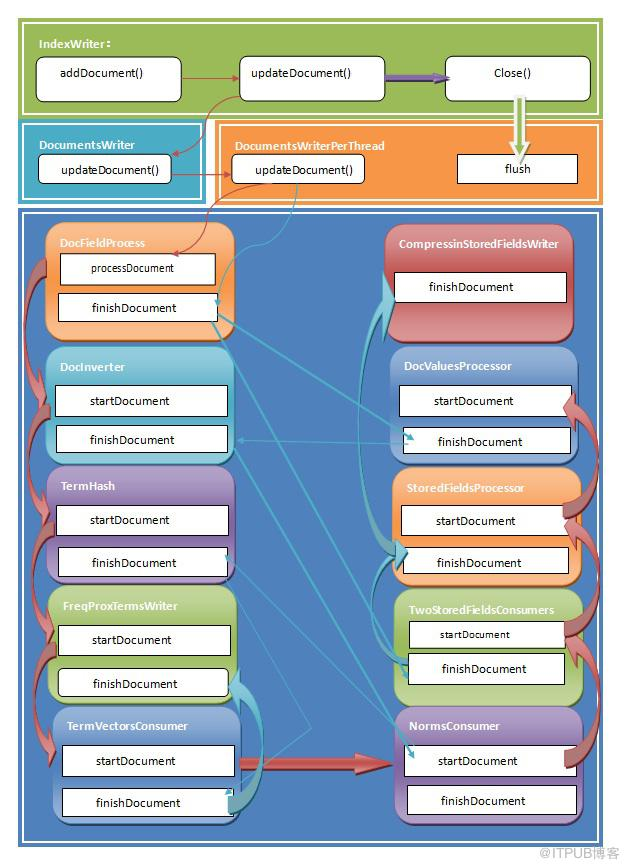

# index create

文档的索引过程是通过`DocumentsWriter`的内部数据处理链完成的，DocumentsWriter可以实现同时添加多个文档并将它们写入一个临时的segment中，完成后再由`IndexWriter`和`SegmentMerger`合并到统一的segment中去。

DocumentsWriter支持多线程处理，即多个线程同时添加文档，它会为每个请求分配一个DocumentsWriterThreadState对象来监控此处理过程。处理时通过DocumentsWriter初始化时建立的DocFieldProcessor管理的索引处理链来完成的，依次处理为DocFieldConsumers、DocInverter、TermsHash、FreqProxTermsWriter、TermVectorsTermsWriter、NormsWriter以及StoredFieldsWriter等



源码调用过程：
1. IndexWriter:addDocument(doc);
2. IndexWriter:addDocument(doc,analyzer);
3. IndexWriter:updateDocument(term,doc,analyzer);
4. DocumentsWriter:updateDocument(doc,analyzer,term);
5. DocumentsWriter:preUpdate() 判断当前线程是该进行合并操作，还是进行新增操作
6. DocumentsWriterPerThread:updateDocument()

```java
public void updateDocument(Iterable doc, Analyzer analyzer, Term delTerm) throws IOException {
    assert writer.testPoint("DocumentsWriterPerThread addDocument start");
    assert deleteQueue != null;
    docState.doc = doc;
    docState.analyzer = analyzer;
    docState.docID = numDocsInRAM;
    if (segmentInfo == null) {
      initSegmentInfo(); // 重点关注
    }
    if (INFO_VERBOSE && infoStream.isEnabled("DWPT")) {
      infoStream.message("DWPT", Thread.currentThread().getName() + " update delTerm=" + delTerm + " docID=" + docState.docID + " seg=" + segmentInfo.name);
    }
    boolean success = false;
    try {
      try {
        consumer.processDocument(fieldInfos); // 重点关注
      } finally {
        docState.clear();
      }
      success = true;
    } finally {
      if (!success) {
        if (!aborting) {
          // mark document as deleted
          deleteDocID(docState.docID);
          numDocsInRAM++;
        } else {
          abort();
        }
      }
    }
    success = false;
    try {
      consumer.finishDocument(); // 重点关注
      success = true;
    } finally {
      if (!success) {
        abort();
      }
    }
    finishDocument(delTerm); // 重点关注
}
```

7. DocumentsWriterPerThread:initSegmentInfo() 初始化段的基本信息
8. DocFieldProcessor:processDocument()

该方法是处理一个文档的调度函数，负责整理文档的各个fields数据,，并创建相应的DocFieldProcessorPerField对象来依次处理每一个field.
该方法首先调用索引链表的startDocument()来初始化各项数据，然后依次遍历每一个fields，将它们建立一个以field名字计算的hash值为key的hash表，值为DocFieldProcessorPerField类型。如果hash表中已存在该field，则更新该FieldInfo（调用FieldInfo.update()方法），如果不存在则创建一个新的DocFieldProcessorPerField来加入hash表中。注意，该hash表会存储包括当前添加文档的所有文档的fields信息，并根据FieldInfo.update()来合并相同field名字的域设置信息。

9. DocInverter:startDocument()
10. TermHash:startDocument()
11. FreqProxTermsWriter:startDocument()
12. TermVectorsConsumer:startDocument()
13. NormsConsumer:startDocument()
14. TwoStoredFieldsConsumers:startDocument()
15. StoredFieldsProcessor:startDocument()

```java
public void reset() {
    numStoredFields = 0;
    storedFields = new IndexableField[1];
    fieldInfos = new FieldInfo[1];
}
```

16. DocValuesProcessor:startDocument()
17. FieldInfos:public FieldInfo addOrUpdate(String name, IndexableFieldType fieldType)
18. DocFieldProcessorPerField:public void addField(IndexableField field)
19. TwoStoredFieldsConsumers:public void addField(int docID, IndexableField field, FieldInfo fieldInfo)
20. StoredFieldsProcessor: public void addField(int docID, IndexableField field, FieldInfo fieldInfo)
21. DocValuesProcessor:public void addField(int docID, IndexableField field, FieldInfo fieldInfo)
22. DocInverterPerField:processFields(final IndexableField[] fields,final int count)
23. Field:tokenStream()
24. TermsHashPerField:start(IndexableField f)
25 .FreqProxTermsWriterPerField:void start(IndexableField f)
26. TermsHashPerField:void add() throws IOException
27. FreqProxTermsWriterPerField:void newTerm(final int termID)
28. TermsHashPerField:void finish()
29. FreqProxTermsWriterPerField:void finish()
30. NormsConsumerPerField:void finish()
31. DocFieldProcessor:void finishDocument()
32. TwoStoredFieldsConsumers:void finishDocument()
33. StoredFieldsProcessor:void finishDocument()
34. CompressingStoredFieldsWriter:public void finishDocument()
35. DocValuesProcessor:void finishDocument()
36. DocInverter:void finishDocument()
37. NormsConsumer:void finishDocument()
38. TermsHash:void finishDocument()
39. TermVectorsConsumer:void finishDocument(TermsHash termsHash)
40. DocumentsWriterPerThread:private void finishDocument(Term delTerm)
41. DocumentsWriterFlushControl:
42. DocumentsWriter:postUpdate
43. IndexWriter:close(true)
44. IndexWriter:private void closeInternal(boolean waitForMerges, boolean doFlush)
45. DocumentsWriter:void close()
46. IndexWriter:protected final void flush(boolean triggerMerge, boolean applyAllDeletes)

```java
IndexWriter:doFlush(boolean applyAllDeletes)
DocumentsWriter:flushAllThreads()
```

47. DocumentsWriter:private  boolean doFlush(DocumentsWriterPerThread flushingDWPT)

> > DocumentsWriterPerThread:FlushedSegment flush()

48. DocFieldProcessor:public void flush(SegmentWriteState state)
49. TwoStoredFieldsConsumers:void flush(SegmentWriteState state)
50. StoredFieldsProcessor:public void flush(SegmentWriteState state)
51. DocValuesProcessor:void flush(SegmentWriteState state)
52. DocInverter:void flush(Map fieldsToFlush, SegmentWriteState state)
53. TermsHash:void flush(Map fieldsToFlush, final SegmentWriteState state)
54. FreqProxTermsWriter:public void flush(Map fieldsToFlush, final SegmentWriteState state)
55. NormsConsumer:public void flush(Map fieldsToFlush, SegmentWriteState state)
56. DocumentsWriterPerThread:doAfterFlush()
57. DocFieldProcessor:void doAfterFlush()
58. IndexWriter: protected void doAfterFlush()