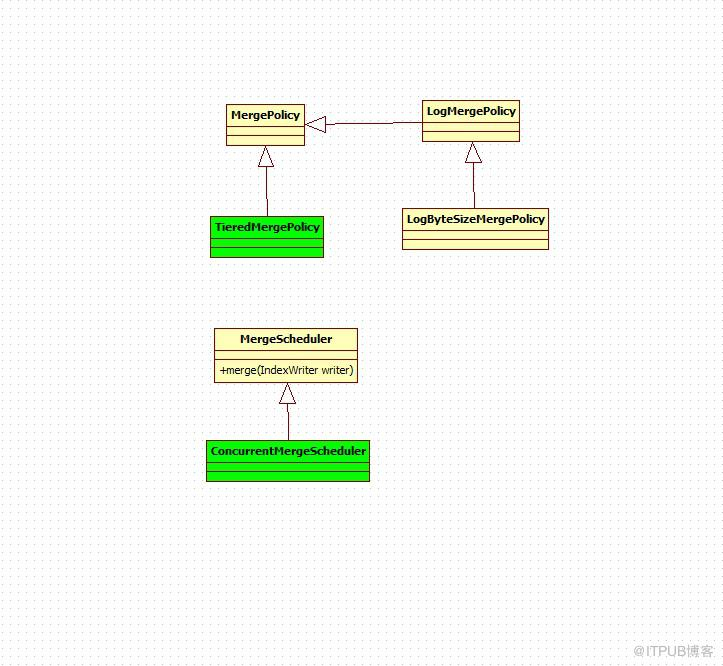

# segment merge

索引段的合并

## IndexWriter 中与段合并有关的成员变量有：

	//保存正在合并的段，以防止合并期间再次选中被合并。
	private HashSet mergingSegments = new HashSet();
	
	//合并策略，也即选取哪些段来进行合并
	private MergePolicy mergePolicy;
	
	//段合并器，背后有一个线程负责合并
	private final MergeScheduler mergeScheduler;
	
	//等待被合并的任务
	private LinkedList pendingMerges = new LinkedList();
	
	//正在被合并的任务
	private Set runningMerges = new HashSet();



## 索引段合并相关类说明：
1. MergePolicy

MergePolicy决定着合并操作的顺序。当InexWriter变更索引中的段信息时，IndexWirter将会调用该类中的findMerges方法，去获取需要进行合并的段。该方法会返回一个MergeSpecification对象来描述要合并段的集合。当IndexWriter调用forceMerge方法时，将会调用该类中的findForcedMerges方法，来返回要进行合并的段。

默认的MergePolicy的实现类是TieredMergePolicy。

2. LogMergePolicy
3. TieredMergePolicy

对于正常的合并，该策略首先计算出一个budget(一个索引中运行合并多少个段)。如果索引中段数超过budget那么，该策略会根据段的大小由小到大排列，找到最少耗费资源的合并操作。

4. MergeScheduler

IndexWriter会调用该类的实例，去执行已选择的合并策略（MergePolicy）。
其默认的实现类为ConcurrentMergeScheduler

5. ConcurrentMergeScheduler

通过单独的线程来执行每个合并操作。

合并过程最重要的是两部分：

* 一个是选择哪些段应该参与合并，这一步由MergePolicy 来决
* 一个是将选择出的段合并成新段的过程，这一步由MergeScheduler 来执行

## 索引段合并的调用过程：

1. IndexWriter:updateDocuments

```java
if (anySegmentFlushed) {
    maybeMerge(MergeTrigger.SEGMENT_FLUSH, 	  UNBOUNDED_MAX_MERGE_SEGMENTS);
}
```

2. IndexWriter:maybeMerge

```java
private final void maybeMerge(MergeTrigger trigger, int maxNumSegments) throws IOException {
	ensureOpen(false);
	updatePendingMerges(trigger, maxNumSegments);
	mergeScheduler.merge(this);
}
```

3. IndexWriter:updatePendingMerges

```java
if (spec != null) {
	final int numMerges = spec.merges.size();
	for(int i=0;i        registerMerge(spec.merges.get(i));
	}
}
```

4. ConcurrentMergeScheduler:merge

```java
merger.start();
if (!success) {
	writer.mergeFinish(merge);
}
```