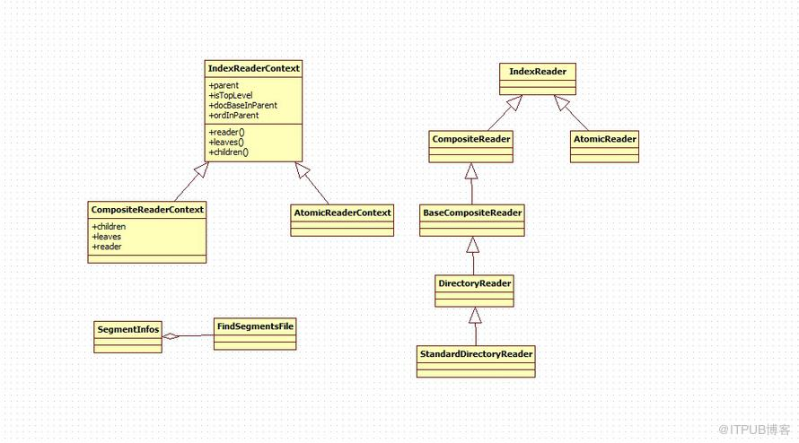

# 搜索过程

## 搜索过程一

> search snippet

```java
public static void main(String[] args) {
    try {
        IndexReader reader=DirectoryReader.open(FSDirectory.open(new File("F:\\index")));
        IndexSearcher searcher=new IndexSearcher(reader);
        Analyzer analyzer=new StandardAnalyzer(Version.LUCENE_43);
        
        QueryParser queryParser=new QueryParser(Version.LUCENE_43, "content", analyzer);
        
        Query query=queryParser.parse("lucene");
        TopDocs topDocs=searcher.search(query, 10);
        
        ScoreDoc[] hits=topDocs.scoreDocs;
        
        for(int i=0;i      {
            System.out.println("score:"+hits[i].score);
            System.out.println("title:"+searcher.doc((hits[i].doc)).get("title"));
        }
    
    } catch (Exception e) {
        e.printStackTrace();
    }   
}
```



### IndexReader

IndexReader是一个抽象类，提供访问索引的接口。对一个索引的查询就是通过该接口。有两种不同的IndexReader。

* AtomicReader：不包含子reader 是一个原子类型的reader 支持存储域，文档值，词和倒排表
* CompositeReader: 一个基于硬盘的IndexReader实例，通常是通过调用DirectoryReader.open()方法来构造的。

对于更有效地方法，通常通过一个唯一的ID来关联一个document。IndexReader是线程安全的。

### IndexReaderContext

代表IndexReader层次关系的一个结构类。

### DirectoryReader

CompositeReader的实现类，可以从一个directory中读取索引信息。通常调用静态方法open(final Directory directory)

### FindSegmentsFile

同当前段文件打交道的工具类。

### IndexReader加载过程

1. FSDirectory调用open方法，打开索引所在的目录

```java
public static FSDirectory open(File path) throws IOException {
    return open(path, null);
}
```

2. FindSegmentsFile调用run函数

首先列出所有的segment_N，并取出其中的最大的N，设为genA

```java
files = directory.listAll();         
if (files != null) {
    genA = getLastCommitGeneration(files);
}
```

另一方面，打开segment.gen 文件，从中读出N，设为genB

> genInput = directory.openInput(IndexFileNames.SEGMENTS_GEN, IOContext.READONCE);

在 genA 和genB 中去较大者，为gen，并用此gen 构造要打开的segments_N 的文件名

```java
gen = Math.max(genA, genB);
segmentFileName = IndexFileNames.fileNameFromGeneration(IndexFileNames.SEGMENTS,"", gen);
```

3. StandardDirectoryReader调用SegmentInfos.FindSegmentsFile的匿名类的doBody()方法，读取段的相关信息。

```java
SegmentInfos sis = new SegmentInfos();
sis.read(directory, segmentFileName);
````

根据生成的SegmentInfos 打开各个段，并生成ReadOnly  DirectoryReader

> readers[i] = new SegmentReader(sis.info(i), termInfosIndexDivisor, IOContext.READ);

4. Lucene42FieldInfosReader调用read方法，读取段相关.fnm文件

```java
public FieldInfos read(Directory directory, String segmentName, IOContext iocontext) throws IOException {
    final String fileName = IndexFileNames.segmentFileName(segmentName, "", Lucene42FieldInfosFormat.EXTENSION);
    IndexInput input = directory.openInput(fileName, iocontext);
   
    boolean success = false;
    try {
      CodecUtil.checkHeader(input, Lucene42FieldInfosFormat.CODEC_NAME,
                                   Lucene42FieldInfosFormat.FORMAT_START,
                                   Lucene42FieldInfosFormat.FORMAT_CURRENT);

      final int size = input.readVInt(); //read in the size
      FieldInfo infos[] = new FieldInfo[size];

      for (int i = 0; i < size; i++) {
        String name = input.readString();
        final int fieldNumber = input.readVInt();
        byte bits = input.readByte();
        boolean isIndexed = (bits & Lucene42FieldInfosFormat.IS_INDEXED) != 0;
        boolean storeTermVector = (bits & Lucene42FieldInfosFormat.STORE_TERMVECTOR) != 0;
        boolean mitNorms = (bits & Lucene42FieldInfosFormat.OMIT_NORMS) != 0;
        boolean storePayloads = (bits & Lucene42FieldInfosFormat.STORE_PAYLOADS) != 0;
        final IndexOptions indexOptions;
        if (!isIndexed) {
          indexOptions = null;
        } else if ((bits & Lucene42FieldInfosFormat.OMIT_TERM_FREQ_AND_POSITIONS) != 0) {
          indexOptions = IndexOptions.DOCS_ONLY;
        } else if ((bits & Lucene42FieldInfosFormat.OMIT_POSITIONS) != 0) {
          indexOptions = IndexOptions.DOCS_AND_FREQS;
        } else if ((bits & Lucene42FieldInfosFormat.STORE_OFFSETS_IN_POSTINGS) != 0) {
          indexOptions = IndexOptions.DOCS_AND_FREQS_AND_POSITIONS_AND_OFFSETS;
        } else {
          indexOptions = IndexOptions.DOCS_AND_FREQS_AND_POSITIONS;
        }

        // DV Types are packed in one byte
        byte val = input.readByte();
        final DocValuesType docValuesType = getDocValuesType(input, (byte) (val & 0x0F));
        final DocValuesType normsType = getDocValuesType(input, (byte) ((val >>> 4) & 0x0F));
        final Map attributes = input.readStringStringMap();
        infos[i] = new FieldInfo(name, isIndexed, fieldNumber, storeTermVector,
          omitNorms, storePayloads, indexOptions, docValuesType, normsType, Collections.unmodifiableMap(attributes));
      }

      if (input.getFilePointer() != input.length()) {
        throw new CorruptIndexException("did not read all bytes from file \"" + fileName + "\": read " + input.getFilePointer() + " vs size " + input.length() + " (resource: " + input + ")");
      }
      FieldInfos fieldInfos = new FieldInfos(infos);
      success = true;
      return fieldInfos;
    } finally {
      if (success) {
        input.close();
      } else {
        IOUtils.closeWhileHandlingException(input);
      }
    }
  }
```

5. 调用CompressingStoredFieldsReader的构造函数读取.fdx,.fdt文件

```java
 public CompressingStoredFieldsReader(Directory d, SegmentInfo si, String segmentSuffix, FieldInfos fn,
      IOContext context, String formatName, CompressionMode compressionMode) throws IOException {
    this.compressionMode = compressionMode;
    final String segment = si.name;
    boolean success = false;
    fieldInfos = fn;
    numDocs = si.getDocCount();
    IndexInput indexStream = null;
    try {
      fieldsStream = d.openInput(IndexFileNames.segmentFileName(segment, segmentSuffix, FIELDS_EXTENSION), context);
      final String indexStreamFN = IndexFileNames.segmentFileName(segment, segmentSuffix, FIELDS_INDEX_EXTENSION);
      indexStream = d.openInput(indexStreamFN, context);

      final String codecNameIdx = formatName + CODEC_SFX_IDX;
      final String codecNameDat = formatName + CODEC_SFX_DAT;
      CodecUtil.checkHeader(indexStream, codecNameIdx, VERSION_START, VERSION_CURRENT);
      CodecUtil.checkHeader(fieldsStream, codecNameDat, VERSION_START, VERSION_CURRENT);
      assert CodecUtil.headerLength(codecNameDat) == fieldsStream.getFilePointer();
      assert CodecUtil.headerLength(codecNameIdx) == indexStream.getFilePointer();

      indexReader = new CompressingStoredFieldsIndexReader(indexStream, si);
      indexStream = null;

      packedIntsVersion = fieldsStream.readVInt();
      decompressor = compressionMode.newDecompressor();
      this.bytes = new BytesRef();

      success = true;
    } finally {
      if (!success) {
        IOUtils.closeWhileHandlingException(this, indexStream);
      }
    }
  }
```

6. SegmentReader读取被删除文档(.del)文件

 ```java
 if (si.hasDeletions()) {
    // NOTE: the bitvector is stored using the regular directory, not cfs
    liveDocs = si.info.getCodec().liveDocsFormat().readLiveDocs(directory(), si, new IOContext(IOContext.READ, true));
}
```

7. 最终获取IndexReader对象

```java
StandardDirectoryReader(Directory directory, AtomicReader[] readers, IndexWriter writer,
    SegmentInfos sis, int termInfosIndexDivisor, boolean applyAllDeletes) {
    super(directory, readers);
    this.writer = writer;
    this.segmentInfos = sis;
    this.termInfosIndexDivisor = termInfosIndexDivisor;
    this.applyAllDeletes = applyAllDeletes;
  }
```

从上面的过程来看，IndexReader 有以下几个特性：

1. 段元数据信息已经被读入到内存中，因而索引文件夹中因为新添加文档而新增加的段对已经打开的reader 是不可见的。
2. .del 文件已经读入内存，因而其他的reader 或者writer 删除的文档对打开的reader 也是不可见的。
3. 一个IndexReader 打开一个索引，就好像对此索引照了一张像，无论背后索引如何改变，此IndexReader 在被重新打开之前，看到的信息总是相同的。

## 搜索过程二

> search code snippet:

```java
public static void main(String[] args) {
    try {
        IndexReader reader=DirectoryReader.open(FSDirectory.open(new File("F:\\index")));
        IndexSearcher searcher=new IndexSearcher(reader);
        Analyzer analyzer=new StandardAnalyzer(Version.LUCENE_43);
        
        QueryParser queryParser=new QueryParser(Version.LUCENE_43, "content", analyzer);
        
        Query query=queryParser.parse("lucene");
        TopDocs topDocs=searcher.search(query, 10);
        
        ScoreDoc[] hits=topDocs.scoreDocs;
        
        for(int i=0;i      {
            System.out.println("score:"+hits[i].score);
            System.out.println("title:"+searcher.doc((hits[i].doc)).get("title"));
        }
        
        // reader.close();

    } catch (Exception e) {
        e.printStackTrace();
    }   
}
```

### IndexSearcher:

在一个单独的IndexReader上实现查找。 应用通常调用search(Query,int)或search(Query,Filter,int)进行检索。 为了性能的考虑，如果你的索引是不变的，你应该为所有的查询应用一个单实例的IndexSearcher而非每个查询创建一个实例。  如果你的索引已经改变，并且你希望检索时看到这些变化，你应该调用DirectoryReader的openIfChanged(DirectoryReader)方法去重新获取reader，然后在该reader上创建一个新的IndexSearcher。

```java
final IndexReader reader;
protected final IndexReaderContext readerContext;
protected final List leafContexts;
protected final LeafSlice[] leafSlices;
private final ExecutorService executor;
private static final Similarity defaultSimilarity = new DefaultSimilarity();
```

IndexSearcher 表面上看起来好像仅仅是reader 的一个封装，它的很多函数都是直接调用reader 的相应函数，如：int docFreq(Term term)，Document doc(int i)，int maxDoc()。然而它提供了两个非常重要的函数：
1. void setSimilarity(Similarity similarity)，用户可以实现自己的Similarity 对象，从而影响搜索过程的打分
2. 一系列search 函数，是搜索过程的关键，主要负责打分的计算和倒排表的合并。

因而在某些应用之中，只想得到某个词的倒排表的时候，最好不要用IndexSearcher，而直接用IndexReader.termDocs(Term term)，则省去了打分的计算。

### IndexSeacher构造函数：

```java
 public IndexSearcher(IndexReaderContext context, ExecutorService executor) {
    assert context.isTopLevel: "IndexSearcher's ReaderContext must be topLevel for reader" + context.reader();
    reader = context.reader();
    this.executor = executor;
    this.readerContext = context;
    leafContexts = context.leaves();
    this.leafSlices = executor == null ? null : slices(leafContexts);
}
```