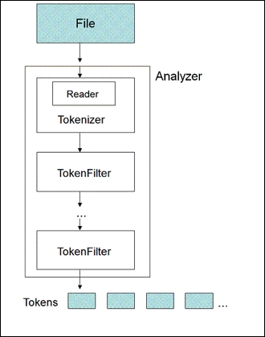

# Chapter 2

## Analyzing Your Text

A term is a fundamental unit of data in a Lucene index. It associates with a Document and itself has two attributes – field and value. An analyzer is responsible for generating these terms. An analyzer is a container of tokenization and filtering processes. Tokenization is a process that breaks up text at word boundaries defined by a specific tokenizer component. 


In this illustration, a tokenizer uses a reader object to consume text. It produces a sequential set of tokens that is called TokenStream. TokenFilter accepts the TokenStream, applies the filtering process, and emits filtered data in TokenStream in return. TokenFilters can be chained together to attain the desired results. A character filter can also be used to preprocess data before tokenization. One example use case for character filters is stripping out HTML tags.

* Stopword filtering
* Text normalization
* Stemming: Snowball, PorterStem, and KStem
* Synonym Expansion(同义词扩展): As the name suggests, this technique expands a word into additional similar-meaning words for matching,

## Obtaining a common analyzer

Lucene provides a set of default analyzers in the **lucene-analyzers-common** package.

* WhitespaceAnalyzer: Splits text at whitespaces, just as the name indicates.
* SimpleAnalyzer: Splits text at non-letter characters and lowercases resulting tokens.
* StopAnalyzer: Splits text at non-letter characters, lowercases resulting tokens, and removes stopwords. This analyzer comes with a default set of stopwords but you can always have the provision to provide your own set of stopwords.
* StandardAnalyzer: Splits text using a grammar-based tokenization, normalizes and lowercases tokens, removes stopwords, and discards punctuations.

> TIP Make sure the lucene-analyzers-common.jar library is also added to the classpath or the corresponding dependency in your pom.xml.

The following would be the output of a WhitespaceAnalyzer:
`[Lucene] [is] [mainly] [used] [for] [information] [retrieval] [and] [you] [can] [read] [more] [about] [it] [at] [lucene.apache.org.]`

SimpleAnalyzer:
`[lucene] [is] [mainly] [used] [for] [information] [retrieval] [and] [you] [can] [read] [more] [about] [it] [at] [lucene] [apache] [org]`

StopAnalyzer:
`[lucene] [mainly] [used] [information] [retrieval] [you] [can] [read] [more] [about] [lucene] [apache] [org]`

StandardAnalyzer:
`[lucene] [mainly] [used] [information] [retrieval] [you] [can] [read] [more] [about] [lucene.apache.org]`

## Obtaining a TokenStream

TokenStream is an intermediate data format between components within the analysis process. TokenStream acts as both an input and output format in all filters. For tokenizer, it consumes text from a reader and outputs result as TokenStream. Let's explore TokenStream in detail in this section.

> tokenStream 

```java
Reader reader = new StringReader("Text to be passed");
Analyzer analyzer = new SimpleAnalyzer();
TokenStream tokenStream = analyzer.tokenStream("myField", reader);
```

TokenStream extends from `AttributeSource` and it provides an interface to return token attributes and value.

## Obtaining TokenAttribute values

From a high level, TokenStream is an enumeration of tokens. To access the values, we will provide TokenStream with one or more attribute objects. Note that there is only one instance that exists per attribute. This is for performance reasons so we are not creating objects in each iteration; instead, the same attribute instances are updated when we increment the token.

* CharTermAttribute: This exposes a token's actual textual value, equivalent to a term's value.

* PositionIncrementAttribute: This returns the position of the current token relative to the previous token. This attribute is useful in phrase-matching as the keyword order and their positions are important. If there are no gaps between the current token and the previous token (for example, no stop words in between), it will be set to its default value, 1.

* OffsetAttribute: This gives you information about the start and end positions of the corresponding term in the source text.

* TypeAttribute: This is available if it is used in the implementation. This is usually used to identify the data type.

* FlagsAttribute: This is somewhat similar to TypeAttribute, but it serves a different purpose. Suppose you need to add specific information about a token and that information should be available down the analyzer chain, you can pass it as flags. TokenFilters can perform any specific action based on the flags of the token.

* PayloadAttribute: This stores the payload at each index position and is generally useful in scoring when used with Payload-based queries. Because it's stored at each position, it is best to have a minimum number of bytes per term in the index to minimize overloading the index with a massive amount of data.

Now we will see Attribute retrieval in action. In this sample, we will use StandardAnalyzer to process the input text and OffsetAttribute and CharTermAttribute to return each token's value and its offsets. Here is the sample code:

```java
StringReader reader = new StringReader("Lucene is mainly used for information retrieval and you can read more about it at lucene.apache.org.");
StandardAnalyzer wa = new StandardAnalyzer();
TokenStream ts = null;

try {
    ts = wa.tokenStream("field", reader);

    OffsetAttribute offsetAtt = ts.addAttribute(OffsetAttribute.class);
    CharTermAttribute termAtt = ts.addAttribute(CharTermAttribute.class);

    ts.reset();

    while (ts.incrementToken()) {
        String token = termAtt.toString();
        System.out.println("[" + token + "]");
        System.out.println("Token starting offset: " + offsetAtt.startOffset());
        System.out.println(" Token ending offset: " + offsetAtt.endOffset());
        System.out.println("");
    }

    ts.end();
} catch (IOException e) {
    e.printStackTrace();
} finally {
    ts.close();
    wa.close();
}
```

***Keep in mind that Attribute objects are reused in each iteration as we increment tokens for performance and efficient memory management.***

How it works…

1. To start processing text, we turn our input stream into StringReader to pass into the Analyzer's tokenStream method.
2. Then we instantiate two attribute objects, OffsetAttribute and CharTermAttribute.
3. The attribute objects are then registered in TokenStream by calling its addAttribute method.
4. Note that we call ts.reset() to reset TokenStream to the beginning. This call is necessary prior to every iteration routine to ensure we always iterate from the beginning.
5. We iterate TokenStream in a while loop by calling ts.incrementToken(). The loop exits when incrementToken() returns false.
6. We call termAtt.toString() to return the current token's value and call the startOffset() and endOffset() methods of offsetAtt to get the offset. Note that the     variables termAtt and offsetAtt are reused in every iteration.
7. Now we call ts.end() to end the TokenStream. This call signals the current TokenStream handler to execute any end-of-stream operations.
8. And lastly, we call the close() method to close out the TokenStream and Analyzer to release any resources used during the analysis process.