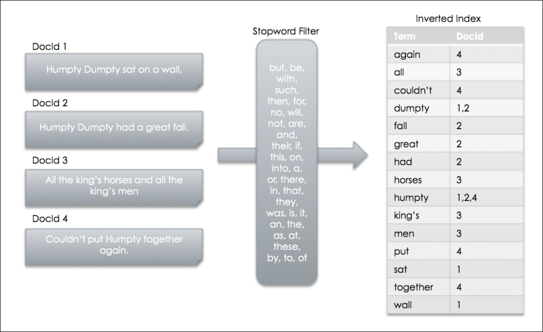
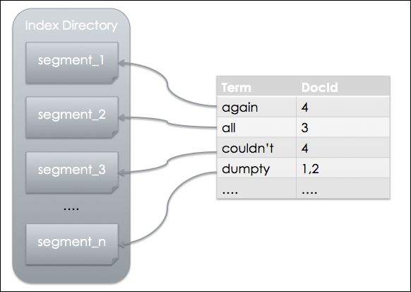
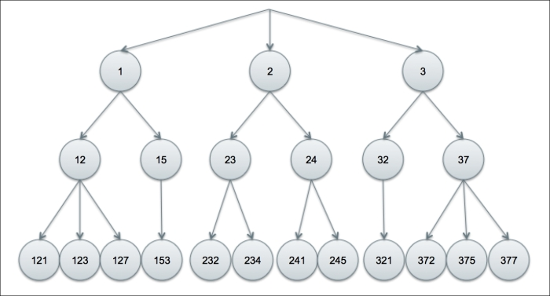

# Indexing Your Data

So far, we covered the basics of setting up Lucene, injecting data, and configuring the analysis process. In this chapter, we will explore the indexing process to learn more about the advanced techniques in configuring and tuning the process.

Let's review what we've learned already on Lucene's internal index structure so far, regarding the inverted index. Consider the following sentences passing through StandardAnalyzer before being added to our index:

```txt
Humpty Dumpty sat on a wall,
Humpty Dumpty had a great fall.
All the king's horses and all the king's men
Couldn't put Humpty together again
```

We will treat each sentence as a document. Below is a figure showing what the documents and inverted index look like:



> Note The diagram does not represent the exact process workflow in Lucene; it is mainly for illustration purpose only.

The preceding diagram illustrates that the Analyzer filters out stopwords and the resulting tokens, generated by the tokenization process, are extracted and stored as individual terms. Note that the inverted index contains a sorted list of terms with an associated DocId for each term. The term to DocId relationship is a one-to-many relationship. The analysis process and the inverted index are important concepts for understanding how to use Lucene effectively.

Another important concept to learn is the segmented nature of Lucene's index file format. Index files are physically separated by segments and they follow a naming standard, where files are named segments_1, then segments_2, and so on. All files belonging to the same segment share the same filename with varying extensions. Each segment is a fully independent index that can be searched separately. Simply adding new documents can generate a new segment.



The terms and documents can exist in any of the segments, depending on when the new documents and terms are added. The IndexReader attributes will merge the index segments internally so that you can access a coherent index without having to consider the index segmentation.


## Obtaining an IndexWriter

We have seen how an IndexWriter is obtained just by simply initialized with an `Analyzer` and `IndexWriterConfig`. The default initialization behavior usually works well for the majority of the time. However, there may be situations where you need finer control during the initialization sequence. For example, when the default behavior creates a new index if an existing index doesn't exist already. This may not be ideal in a production environment where an index should always exist. Generating a new index will automatically hide the issue that an index is missing. Perhaps there was a glitch in the backup routine where it accidentally removed the index, or there was a data corruption issue that somehow wiped out the index directory. In any case, it would be beneficial if we are aware of the indexing status and alerted when issues are detected.

The `IndexWriterConfig`, a configuration object where you set the IndexWriter attributes, provides three OpenMode options to open an index. The options are:

* **APPEND**: This opens an existing index on a directory and allows IndexWriter to update an index. **No new index will be created** with this option. If an existing index doesn't exist already, an exception IndexNotFoundException will be thrown.

* **CREATE**: This creates a new index, if a directory does not contain one already, or it replaces an existing index. This option will always create a fresh index on the supplied directory. **Be careful when using this option because it will overwrite an existing index when one already exists**.

* **CREATE_OR_APPEND**: This is the **default option**. If no index is found in the supplied directory, a new index is created. Otherwise, IndexWriter will append to the existing index. This is a safe option.

> code snippet

```java
FSDirectory directory = FSDirectory.open(new File(indexPath));
Analyzer analyzer = new StandardAnalyzer();
IndexWriterConfig config = new IndexWriterConfig(Version.LATEST, analyzer);
config.setOpenMode(IndexWriterConfig.OpenMode.CREATE);
config.setRAMBufferSizeMB(64);
config.setMaxBufferedDocs(4000);
IndexWriter indexWriter = new IndexWriter(directory, config);
```

In this code snippet, we first initialize a directory object with an indexPath (assuming it is already defined, pointing at an index directory) and set up an Analyzer and IndexWriterConfig. Then, we set the OpenMode on IndexWriterConfig before we pass it onto an IndexWriter. The setOpenMode method is where you can set the desired OpenMode.

In addition to OpenMode, IndexWriterConfig has many other tuneable options. A notable option is **setRAMBufferSizeMB(double)**. **This option allows you to tune the amount of RAM to use for buffering changes before being flushed to the directory**. The buffer is default to 16 MB. In our example, we set it to 64 MB. Another useful tuning option is **setMaxBufferedDocs(int)**; **it lets you set the minimum number of documents required before the buffered documents are flushed as a new segment**. The default value is 1000, but we set it to 4000 in our sample code. When both options are set, the buffer is flushed when whichever condition comes first.

> Note that the changes to index are not visible until commit() or close() is called on Index Writer.

## Creating a StringField

Let's look at a quick recap of field objects in Lucene; they are part of a document containing information about the document. **A field is composed of three parts: name, type, and value**. **Values can be text, binary(? why binary), or numeric**. A field can also be stored in the index so that their values are returned along with hits. Lucene provides a number of field implementations out of the box that are suitable for most applications. In this section, we will cover a field implementation that stores the literal string, StringField. **Any value stored in this field can be indexed, but not tokenized. The entire string is treated as a single token (like keyword in elasticsearch)**.

A tipical usage for StringField is the product model number, phone number, category, and so on.

> code snippet

```java
Document document = new Document();
document.add(new StringField("telephone_number", "04735264927", Field.Store.YES));
document.add(new StringField("area_code", "0484", Field.Store.YES));
indexWriter.addDocument(document);
indexWriter.commit();
```

Field.Store.Yes option. We can control whether the field value should be stored or not.

## Creating a TextField

A StringField is not tokenized and it's a good tool for exact match and sorting. A TextField is tokenized and it's useful for storing any unstructured text for indexing. When you pass the text into an Analyzer for indexing, a TextField is what's used to store the text content.

```java
Document document = new Document();
String text = "Lucene is an Information Retrieval library written in Java.";
doc.add(new TextField("text", text, Field.Store.YES));
indexWriter.addDocument(document);
indexWriter.commit();
```

### Creating a numeric field

Lucene provides four Field classes for storing numeric values. They are `IntField`, `FloatField`, `LongField`, and `DoubleField`, and are analogous to Java numeric types. Lucene, being a text search engine, treats numeral as term internally and indexes them in a trie structure (also called ordered tree data structure) as illustrated in the following:



Each Term is logically assigned to larger and larger predefined lower-precision brackets. For example, let's assume that the brackets are divided by a quotient of division of a lower level by ten as in the preceding diagram. So, under the 1 bracket (at the top level), we get DocId associated with values in the 100s range, and under the 12 bracket, we get association with values in the 120s range and so on. Now, let's say you want to search by numeric range of all documents with the numeric value between 230 and 239: Lucene can simply find the 23 bracket in the index and return all the DocIds underneath. As you can see, this technique allows Lucene to leverage its indexing power to also handle numerals with ease.