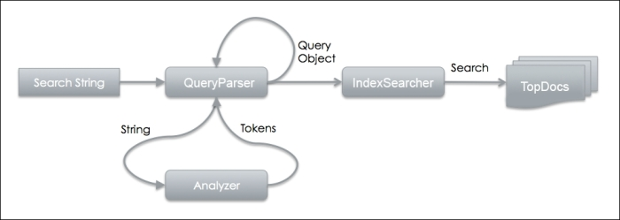

# quick start

## include lucene core

```mvn
<dependency>
    <groupId>org.apache.lucene</groupId>
    <artifactId>lucene-core</artifactId>
    <version>4.10.0</version>
</dependency>
```

## config IndexWriterConfig

how to obtain an IndexWriter:

```java
Analyzer analyzer = new WhitespaceAnalyzer(); 
Directory directory = new RAMDirectory();
IndexWriterConfig config = new IndexWriterConfig(Version.LATEST, analyzer);
IndexWriter indexWriter = new IndexWriter(directory, config);
```

IndexWriter 由两个重要部分组成： **directory** 和 **analyzer**
    * directory: 在哪里持久化索引
    * analyzer: 索引稳定之前怎么处理文档

## Creating an analyzer

analyzer的输出是`token`， 这些token会被`indexer`处理

analyzer在**org.apache.lucene.analysis.core**包下

一个analyzer通常由`Character filter`,`Tokenizer`,`Token filter`组成

analysis phase 包括pre- and post-tokenization functions, and this is where the character filter and token filter come into play

> `Character filter` 用来过滤html, markups 还有用户自定义pattern. Converting a special character or specific text
> The `tokenizer` splits up text into tokens.
> The `token filter` executes the post tokenization filtering; or instance, stemming, stop word filtering, text normalization, and synonym expansion are all part of token filter

***The output of these analysis processes is TokenStream where the indexing process can consume and produce an index***

* StopAnalyzer
* SimpleAnalyzer
* StandardAnalyzer

## Creating fields

一个Lucene field 包括3个属性：Name, Type, Value. 其中Type用来描述这个field是怎么被处理的。可以通过`FieldType`去控制是store value, to index it or even tokenize text.
Field could be:

* String
* Reader or preanalyzed TokenStream
* Binary(byte[])
* Numeric value

> create a TextField

```java
Document doc = new Document();
String text = "Lucene is an Information Retrieval library written in Java.";
doc.add(new TextField("fieldname", text, Field.Store.YES));
```

## Creating and writing documents to an index

> The following code sample shows you an example of adding a simple document to an index:

```java
public class LuceneTest {
  public static void main(String[] args) throws IOException {
    Analyzer analyzer = new WhitespaceAnalyzer();
    Directory directory = new RAMDirectory();
    IndexWriterConfig config = new IndexWriterConfig(Version.LATEST, analyzer);
    IndexWriter indexWriter = new IndexWriter(directory, config);
    Document doc = new Document();
    String text = "Lucene is an Information Retrieval library written in Java";
    doc.add(new TextField("fieldname", text, Field.Store.YES));
    indexWriter.addDocument(doc);
    indexWriter.close();
  }
}
```

***note that we call indexWriter.close() at the end. calling this method, will commit all changes and close the index.***

## Deleting documents

IndexWriter 提供删除文档api：

* deleteDocuments(Term)
* deleteDocuments(Term… terms)
* deleteDocuments(Query)
* deleteDocuments(Query… queries)
* deleteAll( )

>snippet

```java
indexWriter.deleteDocuments(new Term("id", "1"));"));
indexWriter.close();
```

In fact, `deletions do not happen at once`. They are `kept in the memory buffer and later flushed to the directory`. The documents are initially marked as deleted on disk so subsequent searches will simply `skip` the deleted documents; however, to free the memory, you still need to wait.

## Obtaining an IndexSearcher

使用`IndexSearcher`去检索Lucene的索引 An IndexSearcher takes an `IndexReader` object and performs a search via the reader. `IndexReader` talks to the index physically and returns the results. IndexSearcher executes a search by accepting a query object.

```java
Directory directory = getDirectory();
IndexReader indexReader = DirectoryReader.open(directory);
IndexSearcher indexSearcher = new IndexSearcher(indexReader);
```

## Creating queries with the Lucene QueryParser

Lucene supports a powerful query engine that allows for a wide range of query types. You can use search modifier or operator to tell Lucene how matches are done. You can also use fuzzy search and wild card matching.

> query The Backus Normal Form (BNF) is a notation technique to specify syntax for a language, and is often used in computer science.

```text
Query  ::= ( Clause )*
Clause ::= ["+", "-"] [<TERM> ":"] ( <TERM> | "(" Query ")" )
```

***Note that you need to import lucene-queryparser package to use QueryParser. It is not a part of the lucene-core package.***

> snippet

```java
QueryParser parser = new QueryParser("Content", analyzer);
Query query = parser.parse("Lucene");
```

给QueryParser传递一个**name of the query field**, 和一个analyzer
In this case, we are searching a field called Content. Then, we call parse(String) to interpret the search string Lucene into Query object.

## Performing a search

Note that, by default, Lucene sorts results based on relevance. It has a scoring mechanism assigning a score to every matching document. This score is responsible for the sort order in search results. A score can be affected by the rules defined in the query string (for example, must match, AND operation, and so on). It can also be altered programmatically (通过编程改变得分是否影响性能).

> snippet

```java
public class LuceneTest {
    public static void main(String[] args) throws IOException, ParseException {
        Analyzer analyzer = new StandardAnalyzer();
        Directory directory = new RAMDirectory();
        IndexWriterConfig config = new IndexWriterConfig(Version.LATEST, analyzer);
        IndexWriter indexWriter = new IndexWriter(directory, config);
        Document doc = new Document();
        String text = "Lucene is an Information Retrieval library written in Java";
        doc.add(new TextField("Content", text, Field.Store.YES));
        indexWriter.addDocument(doc);
        indexWriter.close();
        IndexReader indexReader = DirectoryReader.open(directory);
        IndexSearcher indexSearcher = new IndexSearcher(indexReader);
        QueryParser parser = new QueryParser( "Content", analyzer);
        Query query = parser.parse("Lucene");
        int hitsPerPage = 10;
        TopDocs docs = indexSearcher.search(query, hitsPerPage);
        ScoreDoc[] hits = docs.scoreDocs;
        int end = Math.min(docs.totalHits, hitsPerPage);
        System.out.print("Total Hits: " + docs.totalHits);
        System.out.print("Results: ");
        for (int i = 0; i < end; i++) {
            Document d = indexSearcher.doc(hits[i].doc);
            System.out.println("Content: " + d.get("Content");
        }
    }
}
```


A search string enters into `QueryParser.parse(String)`. QueryParser then uses an analyzer to process the search string to produce a set of tokens. The tokens are then mapped to the Query object, and get sent to IndexSearcher to execute a search. The search result returned by IndexSearcher is a TopDocs object where it contains statistics of total matches and DocIds of the matching documents.

## Enumerating results

When we perform search in Lucene, actual results are not preloaded immediately. In TopDocs, we only get back an array of ranked pointers. It's called ranked pointers because they are not actual documents, but a list of references (DocId). By default, results are scored by the scoring mechanism.
