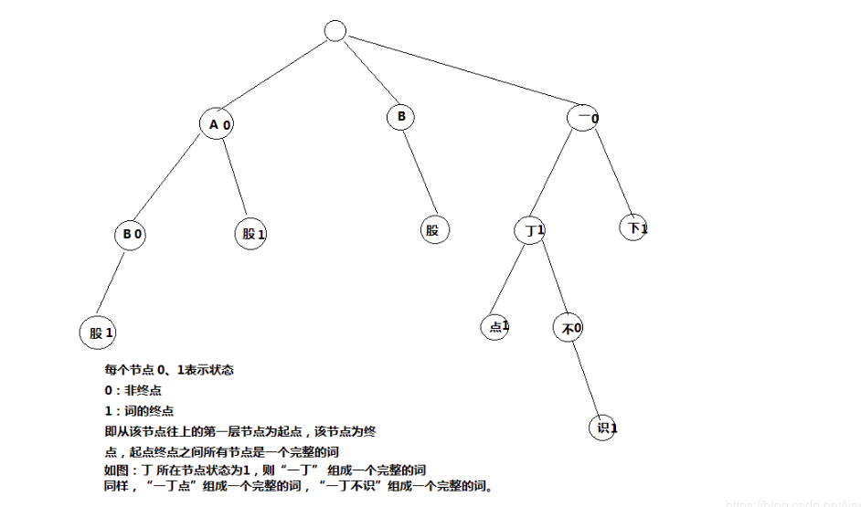

# ik analyzer

目前，IK 分词器自带主词典拥有 27 万左右的汉语单词量。此外，对于分词组件应用场景所涉及的领域不同，需要各类专业词库的支持，为此 IK 提供了对扩展词典的支持。同时，IK 还提供了对用户自定义的停止词（过滤词）的扩展支持。

## 词典的初始化

在分词器 IKSegmenter 首次实例化时，默认会根据 DefaultConfig 找到主词典和中文量词词典路径，同时 DefaultConfig 会根据 classpath 下配置文件`IKAnalyzer.cfg.xml`，找到扩展词典和停止词典路径，用户可以在该配置文件中配置自己的扩展词典和停止词典。

找到个词典路径后，初始化 Dictionary.java，Dictionary 是单例的。在 Dictionary 的构造函数中加载词典。Dictionary 是 IK 的词典管理类，真正的词典数据是存放在 DictSegment 中，该类实现了一种树结构，如下图。



Dictionary 加载主词典，以，将主词典保存到它的\_MainDict 字段中，加载完主词典后，立即加载扩展词典，扩展词典同样保存在\_MainDict 中。

```java
/**
* 加载主词典及扩展词典
*/
private void loadMainDict(){
//建立一个主词典实例
_MainDict = new DictSegment((char)0);
//读取主词典文件
InputStream is = this.getClass().getClassLoader().getResourceAsStream(cfg.getMainDictionary());
if(is == null){
    throw new RuntimeException("Main Dictionary not found!!!");
}
try {
    BufferedReader br = new BufferedReader(new InputStreamReader(is , "UTF-8"), 512);
    String theWord = null;
    do {
        theWord = br.readLine();
        if (theWord != null && !"".equals(theWord.trim())) {
            _MainDict.fillSegment(theWord.trim().toLowerCase().toCharArray());//加载主词典
        }
    } while (theWord != null);
} catch (IOException ioe) {
    System.err.println("Main Dictionary loading exception.");
    ioe.printStackTrace();
}finally{
    try {
        if(is != null){
            is.close();
            is = null;
        }
    } catch (IOException e) {
        e.printStackTrace();
    }
}
//加载扩展词典
this.loadExtDict();
}

/**
* 加载填充词典片段
* @param charArray
* @param begin
* @param length
* @param enabled
*/
private synchronized void fillSegment(char[] charArray , int begin , int length , int enabled){
    //获取字典表中的汉字对象
    Character beginChar = new Character(charArray[begin]);
    //搜索当前节点的存储，查询对应keyChar的keyChar，如果没有则创建
    DictSegment ds = lookforSegment(keyChar , enabled);
    if(ds != null){
        //处理keyChar对应的segment
        if(length > 1){
            //词元还没有完全加入词典树
            ds.fillSegment(charArray, begin + 1, length - 1 , enabled);
        }else if (length == 1){
            //已经是词元的最后一个char,设置当前节点状态为enabled，
            //enabled=1表明一个完整的词，enabled=0表示从词典中屏蔽当前词
            ds.nodeState = enabled;
        }
    }
}

```

***停止词和数量词同样的加载方法。参考Dictionary中loadStopWordDict()和loadQuantifierDict()方法。***

> tips，热词更新:

当词典初始化完毕后，可以调用Dictionary的addWords(`Collection<String> words`)方法往主词典_MainDict添加热词。

```java
/**
* 批量加载新词条
* @param words Collection<String>词条列表
*/
public void addWords(Collection<String> words){
if(words != null){
    for(String word : words){
        if (word != null) {
            //批量加载词条到主内存词典中
            singleton._MainDict.fillSegment(word.trim().toLowerCase().toCharArray());
        }
    }
}
```

## 基于词典的切分

上面提到，主词典加载在Dictionary的_MainDict字段(DictSegment类型)中，

创建IKSegmenter时，需要传进来一个Reader实例，IK分词时，采用流式处理方式。

在IKSegmenter的next()方法中，首先调用`AnalyzeContext.fillBuffer(this.input)`从Reader读取8K数据到到segmentBuff的char数组中，然后调用子分词器CJKSegmenter（中日韩文分词器），CN_QuantifierSegmenter（中文数量词分词器），LetterSegmenter（英文分词器）的**analyze方法依次从头处理segmentBuff中的每一个字符**。

LetterSegmenter.analyze()：英文分词器逻辑很简单，**从segmentBuff中遇到第一个英文字符往后，直到碰到第一个非英文字符，这中间的所有字符则切分为一个英文单词**。

CN_QuantifierSegmenter.analyze()：中文量词分词器处理逻辑也很简单，**在segmentBuff中遇到每一个中文数量词，然后检查该数量词后一个字符是否未中文量词（根据是否包含在中文量词词典中为判断依据），如是，则分成一个词，如否，则不是一个词**。

```java
/**
* 分词，获取下一个词元
* @return Lexeme 词元对象
* @throws IOException
*/
public synchronized Lexeme next()throws IOException {
    Lexeme l = null;
    while ((l = context.getNextLexeme()) == null) {
        /*
            * 从reader中读取数据，填充buffer
            * 如果reader是分次读入buffer的，那么buffer要进行移位处理
            * 移位处理上次读入的但未处理的数据
            */
        int available = context.fillBuffer(this.input);
        if (available <= 0) {
            //reader已经读完
            context.reset();
            return null;
        } else {
            //初始化指针
            context.initCursor();
            do {
                //遍历子分词器
                for (ISegmenter segmenter : segmenters) {
                    segmenter.analyze(context);
                }
                //字符缓冲区接近读完，需要读入新的字符
                if (context.needRefillBuffer()) {
                    break;
                }
            //向前移动指针
            } while (context.moveCursor());
            //重置子分词器，为下轮循环进行初始化
            for (ISegmenter segmenter : segmenters) {
                segmenter.reset();
            }
        }
        //对分词进行歧义处理
        this.arbitrator.process(context, this.cfg.useSmart());
        //处理未切分CJK字符
        context.outputToResult();
        //记录本次分词的缓冲区位移
        context.markBufferOffset();
    }
    return l;
}
```

### CJKSegmenter

CJKSegmenter.analyze则比较复杂一些，拿到第一个字符，调用Dictionary.matchInMainDict()方法，实际就是调用_MainDict.match()方法，在主词典的match方法中去匹配，首先判断该字能否单独成词（即判断_MainDict中该词所在第一个层的节点状态是否为1），如果能则加入上下文中保存起来。然后再判断该词是否可能为其他词的前缀（即判断_MainDict中该词所在第一层节点是否还有子节点），如果是则保存在分词器的临时字段tmpHits中。

再往后拿到segmentBuff中第二个字符，首先判断该词是否存在上一轮保存在temHits中的字符所在节点的子节点中，如果存在则判断这两个字符能否组成完整的词（同样，依据字符节点的状态是否为1来判断），如果成词，保存到上下文中，并且继续判断是否可能为其他词的前缀（还是判断该字符节点是否还有子节点），如果有，继续保存到tmpHits中，如果没有，则抛弃。然后再讲该字符重复与第一个字符一样的操作即可。

```java
public void analyze(AnalyzeContext context) {
    if(CharacterUtil.CHAR_USELESS != context.getCurrentCharType()){
        //优先处理tmpHits中的hit
        if(!this.tmpHits.isEmpty()){
            //处理词段队列
            Hit[] tmpArray = this.tmpHits.toArray(new Hit[this.tmpHits.size()]);
            for(Hit hit : tmpArray){
                hit = Dictionary.getSingleton().matchWithHit(context.getSegmentBuff(), context.getCursor() , hit);
                if(hit.isMatch()){
                    //输出当前的词
                    Lexeme newLexeme = new Lexeme(context.getBufferOffset() , hit.getBegin() , context.getCursor() - hit.getBegin() + 1 , Lexeme.TYPE_CNWORD);
                    context.addLexeme(newLexeme);
                    if(!hit.isPrefix()){//不是词前缀，hit不需要继续匹配，移除
                        this.tmpHits.remove(hit);
                    }
                }else if(hit.isUnmatch()){
                    //hit不是词，移除
                    this.tmpHits.remove(hit);
                }
            }
        }
        //*********************************
        //再对当前指针位置的字符进行单字匹配
        Hit singleCharHit = Dictionary.getSingleton().matchInMainDict(context.getSegmentBuff(), context.getCursor(), 1);
        if(singleCharHit.isMatch()){//首字成词
            //输出当前的词
            Lexeme newLexeme = new Lexeme(context.getBufferOffset() , context.getCursor() , 1 , Lexeme.TYPE_CNWORD);
            context.addLexeme(newLexeme);

            //同时也是词前缀
            if(singleCharHit.isPrefix()){
                //前缀匹配则放入hit列表
                this.tmpHits.add(singleCharHit);
            }
        }else if(singleCharHit.isPrefix()){//首字为词前缀
            //前缀匹配则放入hit列表
            this.tmpHits.add(singleCharHit);
        }
    }else{
        //遇到CHAR_USELESS字符
        //清空队列
        this.tmpHits.clear();
    }
    //判断缓冲区是否已经读完
    if(context.isBufferConsumed()){
        //清空队列
        this.tmpHits.clear();
    }
    //判断是否锁定缓冲区
    if(this.tmpHits.size() == 0){
        context.unlockBuffer(SEGMENTER_NAME);
    }else{
        context.lockBuffer(SEGMENTER_NAME);
    }
}
```

### 基于规则的歧义判断

当子分词器处理完segmentBuff中所有字符后，字符的所有成词情况都已保存到上下文的orgLexemes字段中。

调用分词歧义裁决器IKArbitrator，如果分词器使用细粒度模式（useSmart=false），则裁决器不做不做歧义处理，将上下文orgLexemes字段中所有成词情况全部保存到上下文pathMap中。

然后调用context.outputToResult()方法根据pathMap中的成词情况，将最终分词结果保存到上下文的result字段中。
至此，segmentBuff中所有字符的分词结果全部保存在result中了，通过IKSegmenter.next()方法一个一个返回给调用者。

当next方法返回result所有分词后，分词器再从Reader中读取下一个8K数据到segmentBuff中，重复上述所有步骤，直至Reader全部读取完毕。

分词裁决器IKArbitrator只有在Smart模式才会生效。

**裁决器从上下文orgLexemes读取所有的成词，判断有交叉（有交叉即表示分词有歧义）的成词，然后，遍历每一种不交叉的情况，用LexemePath对象表示，然后保存到自定义有序链表TreeSet中，最后first()取出链表第一个元素，即为最佳分词结果**。

```java
/**
    * 歧义识别
    * @param lexemeCell 歧义路径链表头
    * @param fullTextLength 歧义路径文本长度
    * @return
    */
private LexemePath judge(QuickSortSet.Cell lexemeCell , int fullTextLength){
    //候选路径集合
    TreeSet<LexemePath> pathOptions = new TreeSet<LexemePath>();
    //候选结果路径
    LexemePath option = new LexemePath();
    //对crossPath进行一次遍历,同时返回本次遍历中有冲突的Lexeme栈
    Stack<QuickSortSet.Cell> lexemeStack = this.forwardPath(lexemeCell , option);
    //当前词元链并非最理想的，加入候选路径集合
    pathOptions.add(option.copy());
    //存在歧义词，处理
    QuickSortSet.Cell c = null;
    while(!lexemeStack.isEmpty()){
        c = lexemeStack.pop();
        //回滚词元链
        this.backPath(c.getLexeme() , option);
        //从歧义词位置开始，递归，生成可选方案
        this.forwardPath(c , option);
        pathOptions.add(option.copy());
    }
    //返回集合中的最优方案
    return pathOptions.first();

}
```

IK歧义判断规则如下，优先级从上到下一致降低：

1. 分词文本长度越长越好
2. 分词个数越少越好
3. 分词路径跨度越大越好
4. 分词位置越靠后的优先
5. 词长越平均越好
6. 词元位置权重越大越好（这个我也没明白，先这样，后面有需要再弄明白具体细节）
